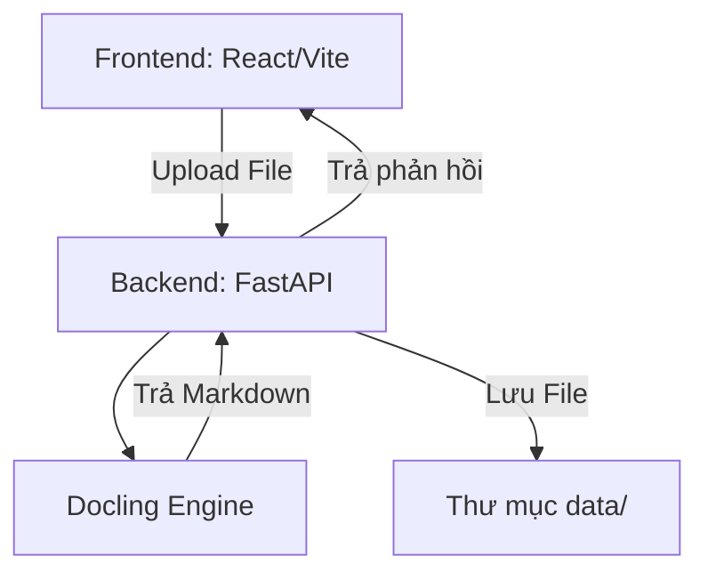

# Kiến Trúc Hệ Thống (Architecture)

## 1. System Overview
Hệ thống gồm:
- **Frontend:** React + Vite, xử lý UI (kéo thả file, cấu hình) và preview Markdown.
- **Backend:** FastAPI (Python), tiếp nhận file, gọi `docling` xử lý và lưu kết quả vào folder `data/`.

## 2. Công nghệ Quyết định
- **Backend:** FastAPI (Python)
- **Frontend:** React (Vite)
- **Data Conversion:** `docling` (môi trường: `docling-env`)

## 3. Ma Trận Diagram (Diagram Matrix)
- `system-overview`: **required**
- `data-flow`: **optional**
- `event-flows`: **N/A**
- `module-dependencies`: **optional**
- `deployment`: **N/A** (chạy local)
- `user-use-case`: **optional**
