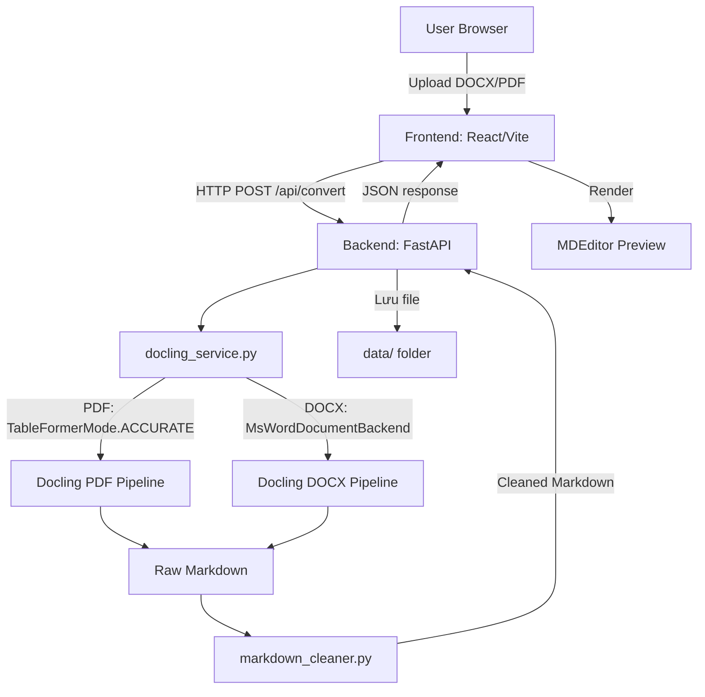
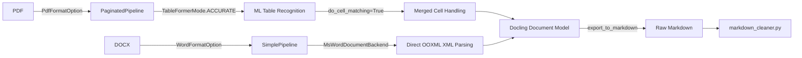

# Kiến Trúc Hệ Thống (Architecture)

## ViePilot organization context
ViePilot profile: none / not configured

## 1. System Overview

Hệ thống gồm 2 layer chính:
- **Frontend:** React + Vite + TypeScript — UI upload file, hiển thị progress, preview/edit Markdown
- **Backend:** FastAPI (Python) — nhận file, gọi Docling, post-process, trả về Markdown



## 2. Services & Modules

### Backend (`backend/src/`)
| Module | Vai trò |
|--------|---------|
| `main.py` | FastAPI app, routing, CORS, static file serving |
| `services/docling_service.py` | Khởi tạo Docling converter, convert file → raw markdown |
| `services/markdown_cleaner.py` | Post-process markdown: fix tables, remove empty cols, convert complex tables to structured lists |

### Frontend (`frontend/src/`)
| File | Vai trò |
|------|---------|
| `App.tsx` | Main logic, state management, upload flow |
| `types.ts` | ProcessingStage type, shared interfaces |
| `components/ProcessingStatus.tsx` | Progress stepper UI |
| `services/api.ts` | Axios HTTP calls to backend |

## 3. Docling Pipeline Architecture



## 4. Markdown Cleaner Architecture

Post-processing pipeline trong `markdown_cleaner.py`:

```
clean_markdown(content)
  → _normalize_line_endings()     # CRLF → LF
  → _clean_tables()               # process mỗi markdown table
      ├── _parse_table()          # parse pipe-format → 2D rows
      ├── _is_complex_table()     # >8 cols OR cell >200 chars?
      │   ├── YES → _table_to_structured_list()
      │   │         nếu empty → KEEP ORIGINAL (never drop)
      │   └── NO  → _count_empty_columns() → _remove_empty_columns()
  → _cleanup_whitespace()         # trailing spaces, blank lines
```

**Invariant:** Không được drop content. Nếu bất kỳ bước nào thất bại → giữ nguyên input.

## 5. Công Nghệ Quyết Định

| Quyết định | Lý do |
|-----------|-------|
| FastAPI thay vì Django | Nhẹ, async-ready, ideal cho local tool |
| TableFormerMode.ACCURATE | Xử lý merged cells, multi-row headers chính xác hơn (2-3x chậm hơn FAST nhưng đáng) |
| WordFormatOption (DOCX) | Direct XML parsing, không cần ML; tốt hơn cho structured content |
| markdown_cleaner post-processing | Docling raw output có bugs với complex tables; cần clean up layer |
| Simulated progress (Phase 6) | SSE phức tạp; simulated progress cho UX ngay; SSE cho Phase 7 |
| MDEditor (@uiw/react-md-editor) | Professional markdown editor với split preview |

## 6. Ma Trận Diagram

| Type | Status | Notes |
|------|--------|-------|
| `system-overview` | **required** | ✅ Có ở mục 1 |
| `data-flow` | **required** | ✅ Docling pipeline mục 3 |
| `module-dependencies` | **optional** | ✅ Cleaner architecture mục 4 |
| `event-flows` | **N/A** | Không có event-driven architecture |
| `deployment` | **N/A** | Chạy local, không có cloud deployment |
| `user-use-case` | **N/A** | Single user, single flow đơn giản |
