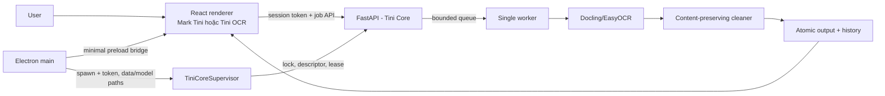
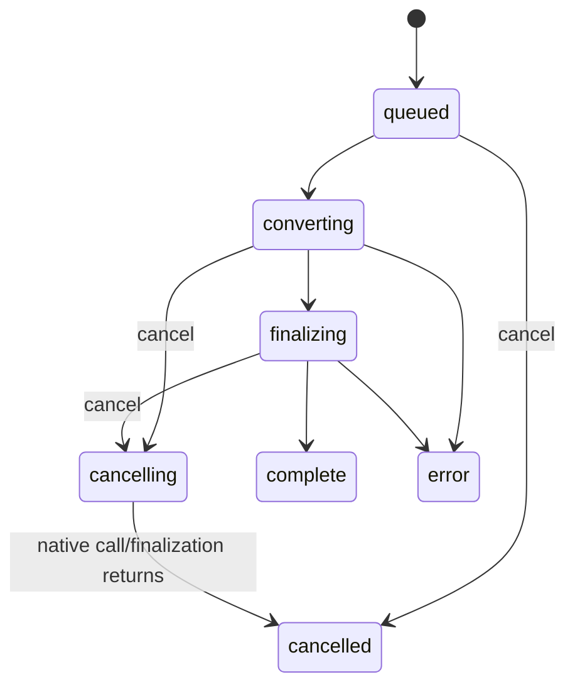
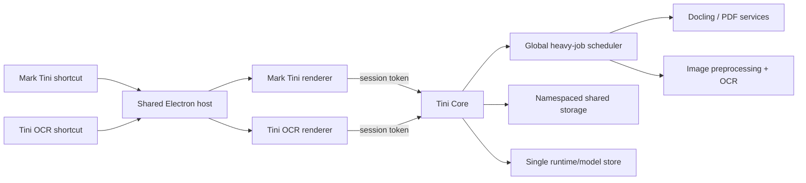

# Kiến trúc hệ thống — v1.6 Tini Suite (hiện tại)

## 1. Tổng quan

**Tini Suite** là bộ ứng dụng desktop local-first gồm hai sản phẩm — **Mark Tini** (document → Markdown/Word) và **Tini OCR** (ảnh → text/Word) — dùng chung một Electron host binary, một **Tini Core** (FastAPI/Docling/EasyOCR backend chạy trên loopback) và một bộ runtime/model. Backend là authority cho validation, trạng thái job, chuyển đổi và persistence; frontend chỉ điều phối và hiển thị. Chi tiết cơ chế dùng chung Core nằm ở §7.

```mermaid
flowchart LR
    U[User] --> R[React renderer<br/>Mark Tini hoặc Tini OCR]
    R -->|session token + job API| A[FastAPI - Tini Core]
    A -->|bounded queue| Q[Single worker]
    Q --> D[Docling/EasyOCR]
    D --> C[Content-preserving cleaner]
    C --> S[Atomic output + history]
    S --> R
    E[Electron main] -->|spawn + token, data/model paths| SV[TiniCoreSupervisor]
    SV -->|lock, descriptor, lease| A
    E -->|minimal preload bridge| R
```

## 2. Ranh giới và invariant

- Electron sinh token ngẫu nhiên cho mỗi process; renderer chỉ nhận các bridge chuyên dụng: token, mở URL `http(s)`, khởi động Ollama đã biết và lưu DOCX đã kiểm tra — không có raw IPC/shell passthrough.
- Mọi API nghiệp vụ cần token; `/api/session` chỉ bootstrap cho trusted localhost origin.
- Tất cả identifier đi vào path phải parse thành UUID trước.
- Upload được stream theo chunk, có allowlist extension và giới hạn mặc định 100 MiB.
- Một worker duy nhất gọi Docling; registry/queue có capacity hữu hạn.
- File tạm luôn được cleanup. Output/history chỉ tồn tại cùng nhau đối với job có lịch sử.
- Xuất Word fidelity cao không tái dựng đối tượng PDF: mỗi trang được render lossless, neo tại `(0,0)` trong section cùng kích thước; vì vậy giữ hình thức nhưng không cung cấp text editable.
- Markdown transform phải bảo toàn nội dung; không chứng minh được thì giữ input gốc.
- Packaged mode không dùng user Python/cache, bắt buộc runtime và artifact cục bộ.

## 3. Job lifecycle

```mermaid
stateDiagram-v2
    [*] --> queued
    queued --> converting
    queued --> cancelled: cancel
    converting --> finalizing
    converting --> cancelling: cancel
    finalizing --> cancelling: cancel
    cancelling --> cancelled: native call/finalization returns
    finalizing --> complete
    converting --> error
    finalizing --> error
```

Docling chạy trong thread nên không thể hard-cancel an toàn. Với job đang chạy, backend công bố `cancelling`, chờ native call kết thúc và loại bỏ kết quả thay vì báo hủy giả.

## 4. Module map

| Module | Trách nhiệm |
|---|---|
| `backend/src/config.py` | token, origin, resource limits, data/model path |
| `backend/src/main.py` | composition root: lifespan, CORS, xác thực, include router theo từng sản phẩm |
| `backend/src/uploads.py` | validate upload dùng chung (extension allowlist, size limit) |
| `backend/src/services/mark_tini/router.py` | route Mark Tini: upload/job/history/export/citation/translation |
| `backend/src/services/mark_tini/job_service.py` | queue, lifecycle, cancel, atomic output cleanup |
| `backend/src/services/mark_tini/history_service.py` | locked atomic JSON persistence và eviction |
| `backend/src/services/mark_tini/docling_service.py` | converter cache, execution lock, offline artifacts |
| `backend/src/services/mark_tini/markdown_cleaner.py` | table parser và content-preservation guard |
| `backend/src/services/tini_ocr/router.py` | route Tini OCR: upload/recognize/export |
| `backend/src/services/tini_ocr/image_ocr_service.py` | pipeline tiền xử lý + nhận dạng chữ từ ảnh |
| `backend/src/services/shared/resource_scheduler.py` | giới hạn một workload ML nặng chạy đồng thời, dùng chung hai sản phẩm |
| `backend/src/services/shared/easyocr_reader.py` | EasyOCR reader dùng chung cho crop vùng (Mark Tini) và Tini OCR |
| `frontend/src/shared/api.ts` | hạ tầng HTTP dùng chung: token, health check, error parsing |
| `frontend/src/products/mark-tini/{MarkTiniApp.tsx,api.ts}` | UI orchestration và API client của Mark Tini |
| `frontend/src/products/tini-ocr/{TiniOcrApp.tsx,api.ts}` | UI orchestration và API client của Tini OCR |
| `frontend/electron/main.ts` | khởi tạo app, `--product` flag, userData, navigation policy, hộp thoại lưu DOCX native, wiring `TiniCoreSupervisor` |
| `frontend/electron/coreSupervisor.ts` | vòng đời Tini Core: atomic lock, spawn `backend/run_server.py`, descriptor PID/port/token, health check trước khi attach, lease/heartbeat, migration dữ liệu legacy |
| `scripts/prepare-offline-bundle.ps1` | reproducible runtime/model preparation và smoke validation |

## 5. Storage

- Development fallback: `<project>/data`.
- Packaged app: `TiniCoreSupervisor` tính `dataDir = <appDataDir>/Tini Suite/data` (`appDataDir` mặc định là `app.getPath('appData')`, có thể override qua `DOCUMARK_APP_DATA_DIR`) rồi truyền xuống Tini Core qua biến môi trường `DOCUMARK_DATA_DIR` khi spawn (`coreSupervisor.ts`). Backend chỉ đọc `DOCUMARK_DATA_DIR` (`backend/src/config.py`), không tự suy ra đường dẫn.
- Lần đầu chạy sau upgrade, `TiniCoreSupervisor` copy các file còn thiếu từ thư mục `data` cũ (`<legacyUserDataDir>/data`, tức `userData` gốc của Electron trước khi có Tini Core) sang `dataDir` mới — idempotent, không ghi đè file đã tồn tại.
- `uploads/<uuid>.<ext>` chỉ là file tạm.
- `outputs/<uuid>.md` chỉ tồn tại cho history entry tương ứng.
- `history.json` newest-first, giới hạn cấu hình được, ghi temp + `fsync` + atomic replace.

## 6. Deployment/offline

`electron-builder` đóng `backend/`, `python_runtime/` và `offline_models/` vào resources. Electron chạy Python bằng `-s` và đặt `DOCUMARK_OFFLINE_MODE`, `DOCLING_ARTIFACTS_PATH`, `HF_HUB_OFFLINE`, `TRANSFORMERS_OFFLINE`, `PYTHONNOUSERSITE`. Preflight khởi tạo pipeline với các cờ này; smoke gate có thể chuyển một PDF thật trước khi build installer.

## 7. Kiến trúc đa sản phẩm — Tini Suite (đã triển khai)

Phần này mô tả kiến trúc đa sản phẩm được quyết định ở Phase 13. Khác với các phiên bản trước của tài liệu này, §7.1/7.2/7.4 dưới đây **đã được triển khai và xác nhận qua code** (`frontend/electron/coreSupervisor.ts`, `frontend/build/nsis/include.nsh`, `frontend/src/products/`) và đang là runtime đang phát hành từ v1.6.0 — không còn là mục tiêu tương lai. Điểm còn lại thật sự chưa triển khai chỉ là việc đổi engine OCR mặc định (§7.3).

```mermaid
flowchart LR
    A[Mark Tini shortcut] --> H[Shared Electron host]
    B[Tini OCR shortcut] --> H
    H --> MR[Mark Tini renderer]
    H --> OR[Tini OCR renderer]
    MR -->|session token| C[Tini Core]
    OR -->|session token| C
    C --> Q[Global heavy-job scheduler]
    Q --> D[Docling / PDF services]
    Q --> O[Image preprocessing + OCR]
    C --> S[Namespaced shared storage]
    C --> M[Single runtime/model store]
```

### 7.1. Product boundary

- Một Electron/Vite project và một host binary được giữ để không nhân đôi framework/runtime (`frontend/package.json` build config: một `productName`, một `appId`).
- Hai shortcut truyền `--product=mark-tini|tini-ocr`; mỗi product có renderer root, icon, title riêng (`frontend/src/products/mark-tini/`, `frontend/src/products/tini-ocr/`, `frontend/build/nsis/include.nsh`).
- Shared UI/contract/bridge nằm ở lớp dùng chung (`frontend/src/shared/api.ts`). Product module không phụ thuộc trực tiếp vào implementation của product còn lại.

### 7.2. Core ownership

Toàn bộ vòng đời dưới đây được hiện thực trong `frontend/electron/coreSupervisor.ts`:

- Product đầu tiên giành atomic lock (`fs.openSync(lockPath, 'wx', ...)` — tạo file độc quyền, thất bại nếu đã tồn tại), khởi động Core (`spawn` trên `backend/run_server.py`) và công bố descriptor gồm PID, port, session token trong `<appDataDir>/Tini Suite/core/session.json`.
- Product sau xác minh cả PID (`isProcessAlive`) lẫn health endpoint (`isHealthy`) trước khi attach; stale descriptor/lock được thu hồi có kiểm soát (`recoverStaleLock`).
- Client lease/heartbeat (mỗi client ghi file riêng trong `core/clients/`, làm mới theo `LEASE_INTERVAL_MS`, coi là stale sau `LEASE_STALE_MS`) quyết định lifetime; Core chạy `detached` + `unref()`, không dùng Windows Service.
- Global scheduler (`backend/src/services/shared/resource_scheduler.py`) mặc định chỉ cho một workload ML nặng chạy để Docling và OCR không tranh bộ nhớ.

### 7.3. OCR boundary

- Tini OCR đã ship và dùng EasyOCR làm engine nhận dạng (`backend/src/services/shared/easyocr_reader.py`, `backend/src/services/tini_ocr/image_ocr_service.py`) — đúng như baseline mô tả bên dưới.
- RapidOCR/ONNX vẫn **chưa** được tích hợp (không có trong `requirements.lock.txt` hay danh sách artifact của `scripts/prepare-offline-bundle.ps1`); đây là điểm duy nhất của §7 còn là mục tiêu tương lai, chờ benchmark/license/bundle-size gate trước khi cân nhắc thay EasyOCR làm default.
- DOCX editable (Mark Tini, PDF → Docling → DOCX chỉnh sửa được) và DOCX image-faithful (§2 — render lossless từng trang, giữ hình thức nhưng không editable) là hai exporter khác nhau với cam kết khác nhau; cả hai đã phát hành trong v1.6.0.
- Chi tiết preprocessing/recipe và cấu trúc kết quả (page/block/line/box/confidence) theo thiết kế ban đầu của Phase 13; xem trực tiếp `image_ocr_service.py` khi cần xác nhận hành vi runtime chính xác.

### 7.4. Packaging invariant

- Installer tạo hai product entry (`CreateShortcut` cho Mark Tini và Tini OCR trong `include.nsh`) nhưng chỉ có một uninstall entry (`perMachine: false`, một `appId`/`productName` NSIS duy nhất).
- Python runtime và mỗi model artifact chỉ tồn tại một lần trong installed resources (`extraResources` trong `frontend/package.json` đóng `python_runtime/` và `offline_models/` một lần, dùng chung cho cả hai shortcut).
- Upgrade từ dữ liệu cũ được migrate idempotent: `TiniCoreSupervisor.prepareDirectoriesAndMigration()` copy các file còn thiếu từ `<legacyUserDataDir>/data` sang `dataDir` mới mà không ghi đè, giữ nguyên dữ liệu người dùng đã có.
