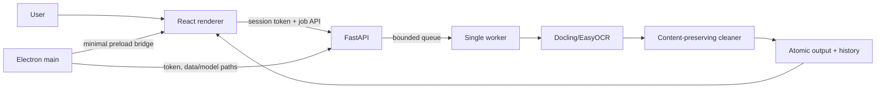
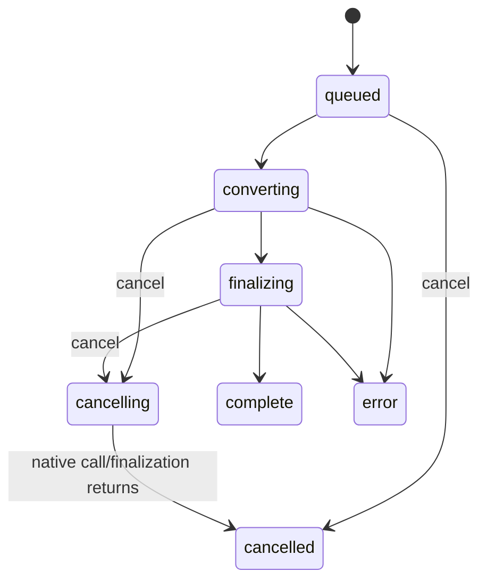

# Kiến trúc hệ thống — v1.5

## 1. Tổng quan

DocuMark là ứng dụng desktop local-first gồm Electron/React renderer và FastAPI/Docling backend chạy trên loopback. Backend là authority cho validation, trạng thái job, chuyển đổi và persistence; frontend chỉ điều phối và hiển thị.

```mermaid
flowchart LR
    U[User] --> R[React renderer]
    R -->|session token + job API| A[FastAPI]
    A -->|bounded queue| Q[Single worker]
    Q --> D[Docling/EasyOCR]
    D --> C[Content-preserving cleaner]
    C --> S[Atomic output + history]
    S --> R
    E[Electron main] -->|token, data/model paths| A
    E -->|minimal preload bridge| R
```

## 2. Ranh giới và invariant

- Electron sinh token ngẫu nhiên cho mỗi process; renderer chỉ nhận các bridge chuyên dụng: token, mở URL `http(s)`, khởi động Ollama đã biết và lưu DOCX đã kiểm tra — không có raw IPC/shell passthrough.
- Mọi API nghiệp vụ cần token; `/api/session` chỉ bootstrap cho trusted localhost origin.
- Tất cả identifier đi vào path phải parse thành UUID trước.
- Upload được stream theo chunk, có allowlist extension và giới hạn mặc định 100 MiB.
- Một worker duy nhất gọi Docling; registry/queue có capacity hữu hạn.
- File tạm luôn được cleanup. Output/history chỉ tồn tại cùng nhau đối với job có lịch sử.
- Xuất Word fidelity cao không tái dựng đối tượng PDF: mỗi trang được render lossless, neo tại `(0,0)` trong section cùng kích thước; vì vậy giữ hình thức nhưng không cung cấp text editable.
- Markdown transform phải bảo toàn nội dung; không chứng minh được thì giữ input gốc.
- Packaged mode không dùng user Python/cache, bắt buộc runtime và artifact cục bộ.

## 3. Job lifecycle

```mermaid
stateDiagram-v2
    [*] --> queued
    queued --> converting
    queued --> cancelled: cancel
    converting --> finalizing
    converting --> cancelling: cancel
    finalizing --> cancelling: cancel
    cancelling --> cancelled: native call/finalization returns
    finalizing --> complete
    converting --> error
    finalizing --> error
```

Docling chạy trong thread nên không thể hard-cancel an toàn. Với job đang chạy, backend công bố `cancelling`, chờ native call kết thúc và loại bỏ kết quả thay vì báo hủy giả.

## 4. Module map

| Module | Trách nhiệm |
|---|---|
| `backend/src/config.py` | token, origin, resource limits, data/model path |
| `backend/src/main.py` | FastAPI boundary, validation, upload/job/history routes |
| `backend/src/services/job_service.py` | queue, lifecycle, cancel, atomic output cleanup |
| `backend/src/services/history_service.py` | locked atomic JSON persistence và eviction |
| `backend/src/services/docling_service.py` | converter cache, execution lock, offline artifacts |
| `backend/src/services/pdf_to_word_service.py` | render PDF tuần tự và tạo DOCX lossless theo từng section/trang |
| `backend/src/services/markdown_cleaner.py` | table parser và content-preservation guard |
| `frontend/src/services/api.ts` | authenticated create/poll/result/cancel client |
| `frontend/src/App.tsx` | UI orchestration từ trạng thái job thật |
| `frontend/electron/main.ts` | backend process, userData, offline env, navigation policy, hộp thoại lưu DOCX native |
| `scripts/prepare-offline-bundle.ps1` | reproducible runtime/model preparation và smoke validation |

## 5. Storage

- Development fallback: `<project>/data`.
- Packaged app: `<Electron userData>/data` qua `DOCUMARK_DATA_DIR`.
- `uploads/<uuid>.<ext>` chỉ là file tạm.
- `outputs/<uuid>.md` chỉ tồn tại cho history entry tương ứng.
- `history.json` newest-first, giới hạn cấu hình được, ghi temp + `fsync` + atomic replace.

## 6. Deployment/offline

`electron-builder` đóng `backend/`, `python_runtime/` và `offline_models/` vào resources. Electron chạy Python bằng `-s` và đặt `DOCUMARK_OFFLINE_MODE`, `DOCLING_ARTIFACTS_PATH`, `HF_HUB_OFFLINE`, `TRANSFORMERS_OFFLINE`, `PYTHONNOUSERSITE`. Preflight khởi tạo pipeline với các cờ này; smoke gate có thể chuyển một PDF thật trước khi build installer.
