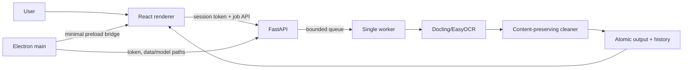
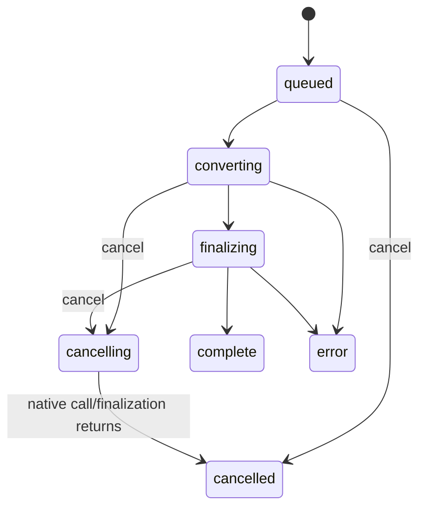
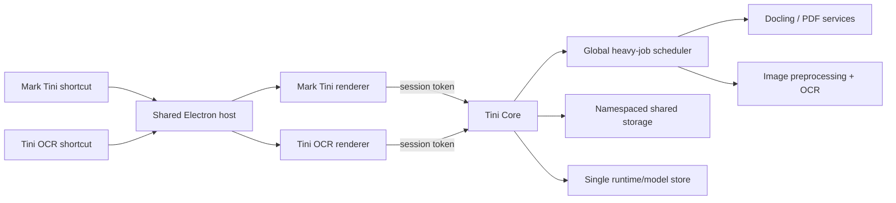

# Kiến trúc hệ thống — v1.5 hiện tại / v1.6 mục tiêu

## 1. Tổng quan

DocuMark là ứng dụng desktop local-first gồm Electron/React renderer và FastAPI/Docling backend chạy trên loopback. Backend là authority cho validation, trạng thái job, chuyển đổi và persistence; frontend chỉ điều phối và hiển thị.

```mermaid
flowchart LR
    U[User] --> R[React renderer]
    R -->|session token + job API| A[FastAPI]
    A -->|bounded queue| Q[Single worker]
    Q --> D[Docling/EasyOCR]
    D --> C[Content-preserving cleaner]
    C --> S[Atomic output + history]
    S --> R
    E[Electron main] -->|token, data/model paths| A
    E -->|minimal preload bridge| R
```

## 2. Ranh giới và invariant

- Electron sinh token ngẫu nhiên cho mỗi process; renderer chỉ nhận các bridge chuyên dụng: token, mở URL `http(s)`, khởi động Ollama đã biết và lưu DOCX đã kiểm tra — không có raw IPC/shell passthrough.
- Mọi API nghiệp vụ cần token; `/api/session` chỉ bootstrap cho trusted localhost origin.
- Tất cả identifier đi vào path phải parse thành UUID trước.
- Upload được stream theo chunk, có allowlist extension và giới hạn mặc định 100 MiB.
- Một worker duy nhất gọi Docling; registry/queue có capacity hữu hạn.
- File tạm luôn được cleanup. Output/history chỉ tồn tại cùng nhau đối với job có lịch sử.
- Xuất Word fidelity cao không tái dựng đối tượng PDF: mỗi trang được render lossless, neo tại `(0,0)` trong section cùng kích thước; vì vậy giữ hình thức nhưng không cung cấp text editable.
- Markdown transform phải bảo toàn nội dung; không chứng minh được thì giữ input gốc.
- Packaged mode không dùng user Python/cache, bắt buộc runtime và artifact cục bộ.

## 3. Job lifecycle

```mermaid
stateDiagram-v2
    [*] --> queued
    queued --> converting
    queued --> cancelled: cancel
    converting --> finalizing
    converting --> cancelling: cancel
    finalizing --> cancelling: cancel
    cancelling --> cancelled: native call/finalization returns
    finalizing --> complete
    converting --> error
    finalizing --> error
```

Docling chạy trong thread nên không thể hard-cancel an toàn. Với job đang chạy, backend công bố `cancelling`, chờ native call kết thúc và loại bỏ kết quả thay vì báo hủy giả.

## 4. Module map

| Module | Trách nhiệm |
|---|---|
| `backend/src/config.py` | token, origin, resource limits, data/model path |
| `backend/src/main.py` | composition root: lifespan, CORS, xác thực, include router theo từng sản phẩm |
| `backend/src/uploads.py` | validate upload dùng chung (extension allowlist, size limit) |
| `backend/src/services/mark_tini/router.py` | route Mark Tini: upload/job/history/export/citation/translation |
| `backend/src/services/mark_tini/job_service.py` | queue, lifecycle, cancel, atomic output cleanup |
| `backend/src/services/mark_tini/history_service.py` | locked atomic JSON persistence và eviction |
| `backend/src/services/mark_tini/docling_service.py` | converter cache, execution lock, offline artifacts |
| `backend/src/services/mark_tini/markdown_cleaner.py` | table parser và content-preservation guard |
| `backend/src/services/tini_ocr/router.py` | route Tini OCR: upload/recognize/export |
| `backend/src/services/tini_ocr/image_ocr_service.py` | pipeline tiền xử lý + nhận dạng chữ từ ảnh |
| `backend/src/services/shared/resource_scheduler.py` | giới hạn một workload ML nặng chạy đồng thời, dùng chung hai sản phẩm |
| `backend/src/services/shared/easyocr_reader.py` | EasyOCR reader dùng chung cho crop vùng (Mark Tini) và Tini OCR |
| `frontend/src/shared/api.ts` | hạ tầng HTTP dùng chung: token, health check, error parsing |
| `frontend/src/products/mark-tini/{MarkTiniApp.tsx,api.ts}` | UI orchestration và API client của Mark Tini |
| `frontend/src/products/tini-ocr/{TiniOcrApp.tsx,api.ts}` | UI orchestration và API client của Tini OCR |
| `frontend/electron/main.ts` | backend process, userData, offline env, navigation policy, hộp thoại lưu DOCX native |
| `scripts/prepare-offline-bundle.ps1` | reproducible runtime/model preparation và smoke validation |

## 5. Storage

- Development fallback: `<project>/data`.
- Packaged app: `<Electron userData>/data` qua `DOCUMARK_DATA_DIR`.
- `uploads/<uuid>.<ext>` chỉ là file tạm.
- `outputs/<uuid>.md` chỉ tồn tại cho history entry tương ứng.
- `history.json` newest-first, giới hạn cấu hình được, ghi temp + `fsync` + atomic replace.

## 6. Deployment/offline

`electron-builder` đóng `backend/`, `python_runtime/` và `offline_models/` vào resources. Electron chạy Python bằng `-s` và đặt `DOCUMARK_OFFLINE_MODE`, `DOCLING_ARTIFACTS_PATH`, `HF_HUB_OFFLINE`, `TRANSFORMERS_OFFLINE`, `PYTHONNOUSERSITE`. Preflight khởi tạo pipeline với các cờ này; smoke gate có thể chuyển một PDF thật trước khi build installer.

## 7. Kiến trúc mục tiêu v1.6 — Tini Suite

Phần này là kiến trúc đã quyết định cho Phase 13 nhưng chưa được triển khai. Kiến trúc v1.5 ở trên vẫn là source of truth cho runtime đang phát hành.

```mermaid
flowchart LR
    A[Mark Tini shortcut] --> H[Shared Electron host]
    B[Tini OCR shortcut] --> H
    H --> MR[Mark Tini renderer]
    H --> OR[Tini OCR renderer]
    MR -->|session token| C[Tini Core]
    OR -->|session token| C
    C --> Q[Global heavy-job scheduler]
    Q --> D[Docling / PDF services]
    Q --> O[Image preprocessing + OCR]
    C --> S[Namespaced shared storage]
    C --> M[Single runtime/model store]
```

### 7.1. Product boundary

- Một Electron/Vite project và một host binary được giữ để không nhân đôi framework/runtime.
- Hai shortcut truyền `--product=mark-tini|tini-ocr`; mỗi product có renderer root, icon, title, settings và history namespace riêng.
- Shared UI/contract/bridge nằm ở lớp dùng chung. Product module không phụ thuộc trực tiếp vào implementation của product còn lại.

### 7.2. Core ownership

- Product đầu tiên giành atomic lock, khởi động Core và công bố descriptor gồm PID, endpoint và session token trong user-scoped data directory.
- Product sau xác minh cả PID lẫn health endpoint trước khi attach; stale descriptor được thu hồi có kiểm soát.
- Client lease/heartbeat quyết định lifetime. Core tự thoát sau grace period khi client cuối rời đi; không dùng Windows Service.
- Global scheduler mặc định chỉ cho một workload ML nặng chạy để Docling và OCR không tranh bộ nhớ.

### 7.3. OCR boundary

- Preprocessing là bước riêng, không ghi đè ảnh gốc và lưu recipe để tái hiện.
- OCR result dùng cấu trúc page/block/line/normalized box/confidence/text, tách khỏi từng engine cụ thể.
- RapidOCR/ONNX chỉ trở thành default sau benchmark/license/bundle gate; EasyOCR luôn là baseline/fallback trong kế hoạch v1.6.
- DOCX editable và DOCX image-faithful là hai exporter khác nhau với cam kết khác nhau.

### 7.4. Packaging invariant

- Installer tạo hai product entry nhưng chỉ có một uninstall entry.
- Python runtime và mỗi model artifact chỉ tồn tại một lần trong installed resources.
- Upgrade từ Mark Tini v1.5.0 phải migrate storage idempotent và giữ dữ liệu người dùng.
