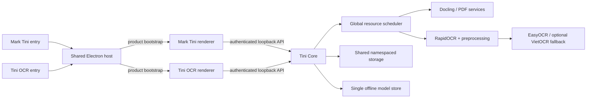

# SPEC — Phase 13: Tini Suite Ecosystem

## 1. Tóm tắt

Phase 13 chuyển Mark Tini từ một ứng dụng đơn lẻ thành **Tini Suite**: một bộ cài Windows offline tạo hai ứng dụng có thể khởi chạy độc lập:

1. **Mark Tini — Document Studio**: giữ toàn bộ chức năng chuyển đổi, biên tập, PDF và xác minh trích dẫn hiện có.
2. **Tini OCR — Image to Text & Word**: chuyển ảnh chụp tài liệu từ điện thoại thành văn bản và DOCX bằng AI chạy cục bộ.

Hai ứng dụng dùng chung **Tini Core**, Python runtime, model OCR, storage và cơ chế cập nhật bộ cài. Mục tiêu phiên bản là **v1.6.0**. Phiên bản đang phát hành vẫn là v1.5.0 cho tới khi toàn bộ release gate của phase này đạt.

## 2. Vấn đề cần giải quyết

- Người dùng muốn một hệ sinh thái thống nhất thay vì dồn mọi luồng công việc vào cùng một màn hình.
- Cài hai ứng dụng riêng theo cách thông thường sẽ nhân đôi Electron, Python runtime và model, trong khi bộ cài hiện tại đã gần 2 GB.
- Mark Tini đang có EasyOCR phục vụ OCR vùng, nhưng chưa có pipeline chuyên xử lý ảnh điện thoại: xoay EXIF, hiệu chỉnh phối cảnh, khử nghiêng, bóng/ánh sáng và đánh giá chất lượng ảnh.
- “Chuyển sang Word y nguyên” và “Word chỉnh sửa được” là hai mục tiêu khác nhau; sản phẩm cần trình bày rõ thay vì hứa một kết quả không thể kiểm chứng.
- Hai cửa sổ có thể chạy đồng thời nhưng không được khởi động hai backend nặng hoặc để lại tiến trình mồ côi.

## 3. Mục tiêu sản phẩm

### 3.1. Một bộ cài, hai ứng dụng

- Start Menu và tùy chọn Desktop có hai mục riêng: **Mark Tini** và **Tini OCR**.
- Mỗi mục có tên, biểu tượng, cửa sổ, lịch sử gần đây và luồng onboarding riêng.
- Hai mục được phép mở đồng thời.
- Một shared Electron host với cờ `--product=mark-tini|tini-ocr` được chấp nhận và là phương án ưu tiên. “Hai ứng dụng” được định nghĩa là hai điểm khởi chạy và hai trải nghiệm độc lập; không bắt buộc nhân đôi hai binary lớn.
- Nâng cấp từ v1.5.0 phải giữ lịch sử, cài đặt và dữ liệu người dùng hiện có.

### 3.2. Tini OCR local-first

- Nhập một ảnh, nhiều ảnh hoặc cả thư mục.
- Định dạng MVP: `.jpg`, `.jpeg`, `.png`, `.tif`, `.tiff`, `.bmp`, `.webp`.
- Không sửa hoặc ghi đè ảnh gốc.
- Tự áp dụng hướng EXIF; cung cấp crop, xoay, hiệu chỉnh bốn góc, deskew và các preset tăng tương phản/khử bóng.
- Hiển thị cảnh báo ảnh mờ, chói, quá tối, độ phân giải thấp hoặc không phát hiện được văn bản.
- Hiển thị vùng nhận dạng và confidence để người dùng rà soát, sửa văn bản trước khi xuất.
- Xử lý hoàn toàn offline sau khi cài đặt.

### 3.3. Đầu ra rõ ràng

- **TXT**: văn bản thuần theo thứ tự đọc.
- **Markdown**: giữ heading, đoạn, danh sách và bảng ở mức OCR có thể suy luận.
- **DOCX chỉnh sửa được**: tái dựng đoạn, danh sách, bảng và ảnh; ưu tiên nội dung có thể sửa, không cam kết khớp pixel.
- **DOCX giữ nguyên hình ảnh**: đặt ảnh gốc/ảnh đã hiệu chỉnh thành trang Word; hình thức trung thành hơn nhưng chữ không chỉnh sửa riêng lẻ.
- UI phải giải thích sự khác biệt trước khi xuất.

## 4. Kiến trúc mục tiêu



### 4.1. Shared host

- `frontend/electron/main.ts` đọc `--product` và bootstrap đúng renderer.
- `frontend/src/App.tsx` được di chuyển theo hướng bảo toàn hành vi thành product root của Mark Tini.
- Thành phần, token giao diện và bridge dùng chung nằm trong namespace `shared`; product module không import chéo trực tiếp.
- Mỗi shortcut dùng AppUserModelID, icon và deep-link riêng nếu Electron/NSIS hỗ trợ ổn định; nếu không, tên shortcut và tham số product là mức tối thiểu bắt buộc.

### 4.2. Tini Core lifecycle

- Cửa sổ đầu tiên khởi động Tini Core và ghi session descriptor vào thư mục dữ liệu Tini Suite.
- Cửa sổ tiếp theo chỉ attach sau khi xác minh PID, health endpoint và token descriptor.
- Tranh chấp khởi động dùng cơ chế atomic lock; stale lock phải được phát hiện bằng cả PID và health check, không chỉ kiểm tra file tồn tại.
- Mỗi client đăng ký một UUID và heartbeat định kỳ. Core tự thoát sau grace period khi không còn client sống.
- Không cài Windows Service và không yêu cầu quyền Administrator trong runtime thường ngày.
- Một global scheduler giới hạn một tác vụ ML nặng tại một thời điểm theo mặc định để tránh tranh RAM giữa Docling và OCR.

### 4.3. OCR engine strategy

- Engine mặc định đề xuất: **RapidOCR/ONNX Runtime** kết hợp OpenCV preprocessing, sau benchmark fixture và kiểm tra license/model artifact.
- **EasyOCR** được giữ làm fallback và baseline tương thích với code hiện tại.
- **VietOCR** chỉ được cân nhắc làm lượt nhận dạng thứ hai cho dòng tiếng Việt confidence thấp; không được kéo vào bundle nếu lợi ích benchmark không đủ bù kích thước và độ phức tạp.
- **PaddleOCR** không được nhúng thẳng vào runtime Python 3.14 của v1.6.0 nếu không có wheel Windows ổn định; chỉ dùng làm accuracy reference hoặc isolated worker trong phase sau.
- **Surya** không thuộc runtime mặc định vì chi phí tài nguyên, xung đột dependency và ràng buộc phân phối cần thẩm định riêng.
- Không model nào được tải ngầm từ Internet khi ứng dụng đang chạy.

## 5. Luồng người dùng Tini OCR

1. Người dùng mở Tini OCR từ Start Menu/Desktop.
2. Chọn ảnh, kéo thả nhiều ảnh hoặc chọn thư mục.
3. Ứng dụng kiểm tra magic bytes, kích thước, số pixel và EXIF; file lỗi được báo riêng, không làm hỏng cả batch.
4. Người dùng sắp xếp thứ tự trang và chọn preset `Nhanh` hoặc `Chính xác`.
5. Pipeline chạy: `queued → preprocessing → detecting → recognizing → reviewing → complete`.
6. Màn hình review hiển thị ảnh, overlay vùng chữ, confidence và text editor đồng bộ theo trang.
7. Người dùng xuất TXT/Markdown/DOCX theo chế độ đã chọn tới vị trí tùy ý, bao gồm USB.
8. Lịch sử lưu metadata và output theo namespace OCR; ảnh gốc chỉ được sao chép vào history khi người dùng cho phép theo chính sách storage.

## 6. API và data contract

### 6.1. Endpoint dự kiến

- `POST /api/ocr/jobs`: tạo OCR job từ một hoặc nhiều ảnh đã kiểm tra.
- `GET /api/ocr/jobs/{job_id}`: trạng thái, progress, page status và warning.
- `POST /api/ocr/jobs/{job_id}/cancel`: hủy theo semantics hiện có.
- `GET /api/ocr/jobs/{job_id}/result`: kết quả có cấu trúc gồm page/block/line/box/confidence/text.
- `PATCH /api/ocr/jobs/{job_id}/result`: lưu chỉnh sửa review có optimistic revision check.
- `POST /api/ocr/jobs/{job_id}/export`: tạo TXT/Markdown/DOCX theo mode.
- `POST /api/core/clients` và heartbeat/shutdown tương ứng chỉ khả dụng với session token tin cậy.

### 6.2. Invariant dữ liệu

- `job_id`, `client_id` và identifier đi vào path phải là UUID hợp lệ.
- Kết quả OCR giữ tọa độ normalized `[0,1]`, confidence gốc, engine/model version và preprocessing recipe để truy vết.
- Chỉnh sửa của người dùng không được ghi đè âm thầm khi revision đã thay đổi.
- Mỗi ảnh lỗi có trạng thái riêng; batch hoàn tất một phần phải công bố rõ và không giả là thành công toàn bộ.
- Output/history ghi atomic; file tạm được cleanup ở mọi terminal state.

## 7. Bảo mật và riêng tư

- Chỉ nhận file có extension allowlist và magic bytes khớp; từ chối polyglot/ảnh hỏng không giải mã an toàn.
- Giới hạn riêng cho dung lượng file, tổng batch, chiều ảnh và tổng pixel để chặn decompression bomb.
- OpenCV/Pillow chạy trên bản sao tạm; metadata nhạy cảm không tự động đưa vào output.
- Renderer không có raw filesystem/shell access; ghi file qua bridge chuyên dụng có kiểm tra extension và payload.
- Tini Core chỉ bind loopback, bắt buộc session token và origin policy như Mark Tini hiện tại.
- Log không chứa nội dung OCR đầy đủ hoặc đường dẫn người dùng ở mức production mặc định.

## 8. Storage và đóng gói

```text
Tini Suite/
  Tini Suite.exe
  resources/
    app.asar
    backend/
    python_runtime/
    offline_models/
      docling/
      easyocr/
      rapidocr/
```

- `python_runtime` và mỗi model artifact chỉ xuất hiện một lần trong installer/layout cài đặt.
- Dữ liệu người dùng chuyển về root ổn định của Tini Suite, phân namespace `mark-tini` và `tini-ocr` nhưng có migration từ `Mark Tini` userData hiện tại.
- Bộ cài tạo hai shortcut với tham số product và icon tương ứng.
- Phân phối bộ cài qua USB là luồng được hỗ trợ; GitHub Release không thuộc phase này.

## 9. Tiêu chí nghiệm thu

### 9.1. Product/installer

- Một lần cài tạo đúng hai điểm khởi chạy độc lập và uninstall duy nhất.
- Mở đồng thời hai sản phẩm chỉ tạo một Tini Core và một bản của từng runtime/model artifact.
- Đóng cả hai sản phẩm làm Tini Core tự thoát trong tối đa 45 giây, không còn tiến trình Python mồ côi.
- Cài đè từ v1.5.0 giữ được history/cấu hình Mark Tini và shortcut cũ được thay thế có chủ đích.
- Bộ cài chạy được trên máy Windows sạch không có Python, Node, Ollama hoặc Internet.

### 9.2. Không hồi quy Mark Tini

- Toàn bộ backend test, frontend lint/build và Electron E2E hiện có đạt.
- Chuyển PDF dài, batch thư mục, mở tài liệu gốc, OCR vùng, responsive toolbar và PDF-to-Word vẫn hoạt động.
- Ollama tiếp tục là backend tùy chọn; không trở thành dependency bắt buộc của Tini OCR.

### 9.3. Chất lượng OCR

- Có benchmark fixture được phân nhóm: ảnh sạch, nghiêng/phối cảnh, ánh sáng không đều, tiếng Việt có dấu, bảng và tài liệu Việt–Anh.
- Candidate mặc định không kém EasyOCR baseline ở bất kỳ nhóm bắt buộc nào và cải thiện CER tổng thể tối thiểu 20% trên fixture đã khóa.
- Với file hợp lệ nhưng chất lượng kém, UI phải cảnh báo và cho sửa; không trả output rỗng như thành công nếu detector từng phát hiện chữ.
- DOCX chỉnh sửa được có text normalized khớp kết quả review; DOCX giữ nguyên hình ảnh có đủ trang, đúng thứ tự và hướng.

### 9.4. Resource gate

- Scheduler chứng minh không chạy song song hai workload ML nặng mặc định.
- Batch 100 ảnh điện thoại không làm UI mất phản hồi và có thể cancel.
- Dung lượng installer tăng không quá 350 MiB so với v1.5.0 nếu không có phê duyệt riêng; báo cáo phải tách rõ runtime/model nào làm tăng dung lượng.

## 10. Ngoài phạm vi v1.6.0

- Tài khoản, cloud sync, cộng tác thời gian thực hoặc mô hình thuê bao Office 365.
- Ứng dụng mobile/camera companion.
- Cam kết nhận dạng chữ viết tay chính xác.
- Chỉnh sửa DOCX vừa pixel-identical tuyệt đối vừa có text/object tái dựng hoàn toàn.
- Windows Service, auto-update qua Internet hoặc GitHub Release.
- Nhúng PaddleOCR/Surya bằng một runtime Python thứ hai nếu chưa vượt benchmark và packaging gate.
- Searchable PDF và HEIC có thể đưa vào phase sau sau khi xác nhận nhu cầu.

## 11. Rủi ro chính và biện pháp

| Rủi ro | Mức | Biện pháp bắt buộc |
|---|---:|---|
| Hai app tranh quyền khởi động Core | Cao | Atomic lock + PID/health validation + integration test concurrent launch |
| Backend/model bị đóng gói trùng | Cao | Script kiểm kê hash và fail build khi duplicate artifact |
| OCR ảnh điện thoại không ổn định | Cao | Dataset phân nhóm, CER baseline, quality warning và manual review |
| Python 3.14 thiếu wheel OCR | Cao | RapidOCR/ONNX probe trước; giữ EasyOCR fallback; không thêm runtime thứ hai mặc định |
| Nâng cấp làm mất history | Cao | Migration idempotent, backup metadata và test cài đè v1.5.0 |
| Hai workload gây cạn RAM | Cao | Global scheduler một heavy job, queue bounded và telemetry cục bộ tối thiểu |
| Người dùng hiểu sai DOCX fidelity | Trung bình | Hai mode có mô tả/preview rõ và acceptance riêng |
| Branding mới làm khó người dùng cũ | Trung bình | Giữ tên Mark Tini cho sản phẩm tài liệu, onboarding Tini Suite ngắn gọn |

## 12. Definition of Done

- Mọi acceptance criterion tự động hóa được đã có test và đạt.
- Benchmark OCR, dependency license, model source/hash và bundle-size report được lưu trong repo.
- Clean-machine install/upgrade/offline smoke đạt bằng artifact v1.6.0 candidate.
- Tài liệu người dùng mô tả hai app, mode xuất, riêng tư, cấu hình tối thiểu và cách copy setup qua USB.
- Chỉ sau các gate trên mới đồng bộ version runtime/package lên 1.6.0 và ghi changelog là đã phát hành.
