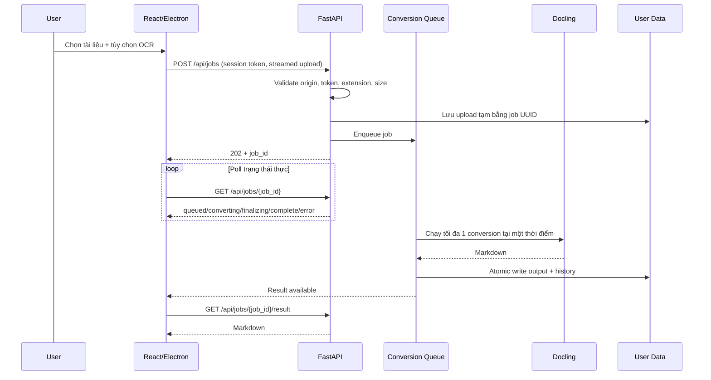

# SPEC — v1.2.0 Reliability, Security & True Offline Packaging

## 1. Mục tiêu

Đưa DocuMark AI từ trạng thái “chạy được trên máy phát triển” thành một ứng dụng local-first có ranh giới bảo mật rõ ràng, không làm mất nội dung, có tiến độ xử lý trung thực, dữ liệu bền vững và bản cài đặt có thể chạy trên máy Windows sạch.

Milestone này hợp nhất và thay thế phần công việc còn dang dở của Phase 4–7: sửa mất dữ liệu bảng, cải thiện chất lượng PDF, hoàn thiện trạng thái xử lý và thay progress giả bằng job workflow thực tế.

## 2. Vấn đề đã xác minh

### P0 — Release blocker

1. API download cho phép Windows path traversal qua `job_id`; CORS wildcard cho phép website khác đọc phản hồi.
2. Release đóng gói một virtualenv phụ thuộc `C:\Python314`; model Docling/EasyOCR nằm ngoài installer.
3. Markdown cleaner bỏ mất hàng dữ liệu in đậm trong bảng phức tạp.
4. Tài liệu nguồn và output của người dùng đã được Git theo dõi.

### P1 — Reliability / correctness

1. Upload không có giới hạn kích thước/định dạng và conversion không có hàng đợi.
2. OCR nhiều vùng chạy song song, có thể tạo nhiều pipeline ML cạnh tranh RAM/CPU.
3. `record_history=false` vẫn sinh output mồ côi; history pruning không xóa output cũ.
4. Progress frontend là timer mô phỏng, không phản ánh trạng thái backend.
5. Timeout frontend không dừng conversion backend.
6. Dữ liệu production nằm trong `resources/` của ứng dụng thay vì thư mục user data.

### P2 — Maintainability / product completeness

1. Không có test suite tự động cho API và Markdown transformations.
2. Version và tài liệu lệch giữa backend, frontend, installer và tracker.
3. Preload mở generic `ipcRenderer`; startup scripts không fail-fast.
4. Bundle chứa dependency `sharp` không được sử dụng và đang có advisory mức high.

## 3. Luồng nghiệp vụ mục tiêu

## 4. Yêu cầu chức năng

### F1. Session boundary cho local API

- Backend sinh session token ngẫu nhiên khi không được cung cấp qua biến môi trường.
- Electron truyền token cho backend và renderer qua bridge tối thiểu.
- Browser development lấy token qua endpoint bootstrap chỉ chấp nhận trusted localhost origins.
- Mọi `/api/*` nghiệp vụ, trừ bootstrap session, phải có token hợp lệ.
- CORS chỉ cho phép origin localhost cấu hình trước; không dùng wildcard.

### F2. Input và path safety

- Mọi job/history identifier phải là UUID hợp lệ.
- Chỉ nhận `.pdf`, `.docx`, `.pptx`, `.html`, `.htm`, `.png`, `.jpg`, `.jpeg`, `.tiff`, `.bmp`.
- Giới hạn upload mặc định 100 MiB, cấu hình được bằng environment.
- File tạm luôn bị xóa sau complete/error/cancel.
- Không ghép path từ chuỗi chưa được validate.

### F3. Job queue và tiến độ thực

- API tạo job bất đồng bộ và trả `202 Accepted` sau khi lưu upload.
- Trạng thái: `queued`, `converting`, `finalizing`, `complete`, `cancelling`, `cancelled`, `error`.
- Chỉ chạy một Docling conversion tại một thời điểm mặc định.
- Cancel queued job có hiệu lực ngay; cancel running job phải hiển thị trung thực là “đang chờ tác vụ native kết thúc”, sau đó bỏ kết quả.
- Endpoint convert cũ được giữ trong một chu kỳ để tương thích, nhưng dùng cùng giới hạn/semaphore.

### F4. Không mất dữ liệu Markdown

- Chỉ hàng nằm trước separator mới được xem là header.
- Không dùng định dạng bold để suy đoán và loại bỏ data row.
- Parser phải tôn trọng escaped pipe và inline code span.
- Mọi transform phức tạp phải chạy kiểm tra content preservation; nếu không chứng minh được thì trả bảng gốc.

### F5. History và storage bền vững

- Production data nằm tại `app.getPath('userData')/data` thông qua `DOCUMARK_DATA_DIR`.
- History write dùng temp file + atomic replace.
- Khi history vượt giới hạn, output tương ứng phải được xóa.
- Job `record_history=false` không ghi output lâu dài.
- Không commit runtime data; repository phải có công cụ phát hiện tracked runtime data.

### F6. True offline packaging

- Installer đóng gói Python base runtime độc lập, không đóng gói virtualenv.
- Build preflight cài dependencies vào runtime bằng `-s` để không dùng user site-packages.
- `docling-tools models download layout tableformer easyocr` tải model vào `offline_models/`.
- Packaged app đặt `DOCLING_ARTIFACTS_PATH`, `HF_HUB_OFFLINE=1`, `TRANSFORMERS_OFFLINE=1`.
- Build phải fail nếu runtime, EasyOCR hoặc model artifacts còn thiếu.

## 5. Yêu cầu phi chức năng

- Không có request mạng trong packaged conversion path.
- API không được làm nghẽn event loop khi lưu upload hoặc chạy Docling.
- Lỗi trả về cho người dùng không chứa absolute path/traceback.
- Lint, TypeScript build, Python compile và automated tests phải pass.
- Không sửa/xóa tài liệu người dùng khỏi working tree nếu chưa có thao tác cleanup riêng được phê duyệt.

## 6. Tiêu chí chấp nhận

1. Path traversal test trả 404/422, không bao giờ trả file ngoài output.
2. Origin không tin cậy không lấy được session token và không gọi API nghiệp vụ.
3. Regression test bảng 9 cột giữ đủ mọi cell của hàng in đậm.
4. Hai job đồng thời được xếp hàng và không chạy Docling song song.
5. Region extraction không tạo file output mồ côi.
6. History eviction xóa output tương ứng.
7. Frontend hiển thị trạng thái backend thực, không dùng timer mô phỏng.
8. Packaged preflight xác minh Python runtime độc lập và model offline trước electron-builder.
9. Version hiển thị thống nhất là `1.2.0`.

## 7. Ngoài phạm vi milestone

- Distributed worker hoặc multi-user authentication.
- Cloud sync/telemetry.
- Dừng cưỡng bức một native ML call đang chạy trong cùng process; muốn hard-cancel cần tách mỗi conversion thành subprocess ở milestone sau.
- Tự động xóa lịch sử Git chứa tài liệu người dùng; đây là thao tác phá hủy lịch sử và cần phê duyệt riêng.
