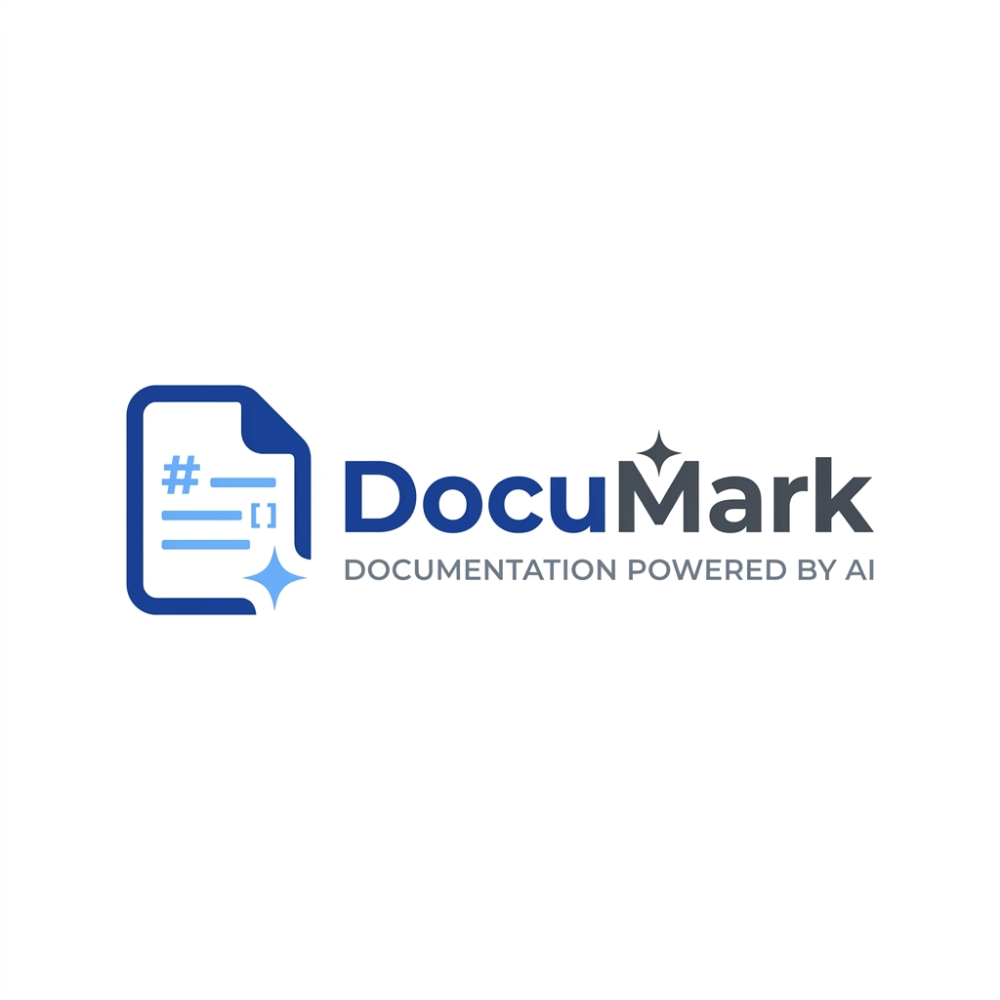

<div align="center">
  
  
  <h1>DocuMark AI Editor</h1>
  <p><strong>A Modern, Offline-First PDF to Markdown Conversion Engine</strong></p>

  <p>
    <a href="#features">Features</a> •
    <a href="#architecture">Architecture</a> •
    <a href="#installation">Installation</a> •
    <a href="#usage">Usage</a>
  </p>
</div>

---

## ⚡ Overview

**DocuMark AI Editor** is an advanced, privacy-first desktop application designed to seamlessly convert complex documents (PDF, DOCX, PPTX) into structured Markdown format. Powered by an isolated **Docling FastAPI** backend and a sleek **React/Vite Electron** frontend, it ensures that your sensitive data never leaves your machine.

## ✨ Features

- 🔒 **100% Local Processing:** Total privacy. No cloud APIs, no external data sent.
- 📄 **Complex Document Parsing:** Accurately extracts text, tables, images, and math formulas from PDFs.
- ✍️ **Professional MDEditor:** A built-in, Notion-style Markdown editor with auto-save capabilities.
- 🎨 **Luxury UI/UX:** A minimalist, distraction-free interface built with modern Tailwind CSS v3.
- 🚀 **Desktop Native:** Packaged as a standalone Windows Electron `.exe` application for zero-setup workflows.

## 🏗️ Architecture

DocuMark AI leverages a hybrid stack for maximum performance and user experience:

- **Frontend Core:** React 19, TypeScript, Vite, Tailwind CSS, `@uiw/react-md-editor`
- **Backend Core:** Python, FastAPI, Uvicorn, Docling
- **Desktop Wrapper:** Electron, electron-builder
- **Inter-Process Communication:** The Electron Main Process spawns the FastAPI server dynamically upon startup and gracefully terminates it on exit.

## 📦 Installation

### Prerequisites
- Node.js (v18+)
- Python (v3.10+)

### Setup Instructions

1. **Clone the repository**
   ```bash
   git clone https://github.com/danghoangsqtt-sys/dhsystem_mdconverter.git
   cd dhsystem_mdconverter
   ```

2. **Setup the Python Backend**
   ```bash
   python -m venv docling-env
   .\docling-env\Scripts\activate
   pip install -r backend\requirements.txt
   ```

3. **Install Frontend Dependencies**
   ```bash
   cd frontend
   npm install
   ```

4. **Launch Application (Development Mode)**
   ```bash
   npm run dev:electron
   ```

5. **Build Desktop App (.exe)**
   ```bash
   npm run build:electron
   ```
   The executable will be located in `frontend/dist/win-unpacked/frontend.exe`.

## 🖥️ Usage

1. **Launch DocuMark AI** from your desktop shortcut.
2. Click **"Chọn PDF & Chuyển đổi"** (Select PDF & Convert) to upload your document.
3. Wait for the **AI Core Engine** to analyze and extract the document structure.
4. Edit the result in the **Live Markdown Editor**.
5. Click **"Save"** or **"Copy"** when you are satisfied with the output.

---

<div align="center">
  <i>Developed with ❤️ using ViePilot Vibe Coding Architecture</i>
</div>
