# Báo cáo kỹ thuật — Mark Tini Editor v1.2.0

Ngày lập báo cáo: 20/08/2026
Phiên bản: 1.2.0 (build offline mới nhất, đã fix lỗi đóng gói model dịch và lỗi crash khi mở app sau cài đặt)

---

## Mục lục

1. [Tổng quan dự án](#1-tổng-quan-dự-án)
2. [Kiến trúc hệ thống](#2-kiến-trúc-hệ-thống)
3. [Lưu đồ thuật toán từng phân hệ](#3-lưu-đồ-thuật-toán-từng-phân-hệ)
4. [Tính năng sản phẩm](#4-tính-năng-sản-phẩm)
5. [Các dịch vụ backend & danh sách API](#5-các-dịch-vụ-backend--danh-sách-api)
6. [Model AI đang sử dụng](#6-model-ai-đang-sử-dụng)
7. [Thông số kỹ thuật & cấu hình](#7-thông-số-kỹ-thuật--cấu-hình)
8. [Tính ứng dụng](#8-tính-ứng-dụng)
9. [Hướng dẫn cài đặt và chạy test trên máy khách hàng](#9-hướng-dẫn-cài-đặt-và-chạy-test-trên-máy-khách-hàng)
10. [Hướng dẫn sử dụng nhanh](#10-hướng-dẫn-sử-dụng-nhanh)
11. [Trạng thái hiện tại & giới hạn đã biết](#11-trạng-thái-hiện-tại--giới-hạn-đã-biết)

---

## 1. Tổng quan dự án

Mark Tini Editor là ứng dụng desktop cho Windows, chuyển tài liệu (PDF, DOCX, PPTX, HTML, ảnh) sang Markdown. Toàn bộ xử lý AI chạy **cục bộ trên máy người dùng** — không upload tài liệu lên server nào, không cần tài khoản, không cần internet cho luồng chuyển đổi chính.

Ứng dụng nhắm tới người dùng làm việc với tài liệu khoa học/kỹ thuật tiếng Anh (nghiên cứu sinh, nhà nghiên cứu): giữ nguyên bảng biểu, công thức toán/lý/hóa, khối mã nguồn khi chuyển sang Markdown, và bổ sung thêm các công cụ hỗ trợ đọc hiểu (dịch, xác minh trích dẫn) ngay trong luồng làm việc.

**Kiến trúc tổng quát:**

```
Electron (vỏ desktop) ── React UI ── token + HTTP ──> FastAPI (Python) ──> hàng đợi 1-worker ──> Docling / model AI
```

- Giao diện và backend đóng gói chung trong 1 file cài đặt, không cần người dùng cài Python/Node riêng.
- Backend chỉ lắng nghe trên `127.0.0.1:8088` (localhost), có token phiên riêng cho mỗi lần mở app — tiến trình khác trên máy không gọi được API này.
- Toàn bộ 3 tầng (Electron, React, FastAPI) chạy trong cùng 1 máy, không có thành phần server-side nào bên ngoài máy người dùng, trừ 2 lời gọi mạng tùy chọn (OpenAlex, Ollama cục bộ — xem mục 5.1).

---

## 2. Kiến trúc hệ thống

### 2.1. Sơ đồ thành phần

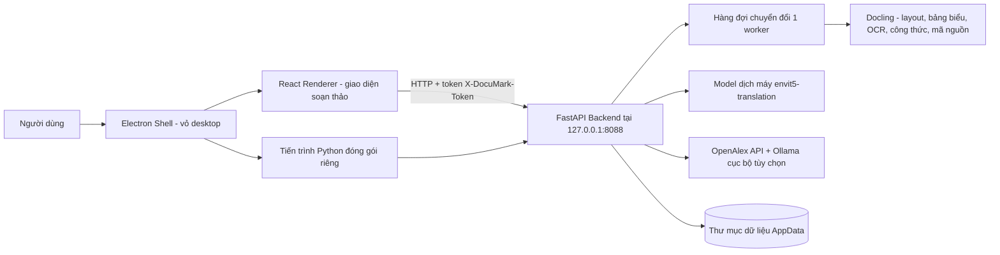

Electron giữ vai trò "vỏ" khởi chạy và giám sát một tiến trình Python độc lập (chạy FastAPI qua uvicorn), đồng thời hiển thị giao diện React trong cửa sổ trình duyệt nội bộ (Chromium). React không gọi trực tiếp vào Electron/Node — mọi thao tác nghiệp vụ đều đi qua HTTP tới backend, với `contextIsolation: true`, `nodeIntegration: false`, `sandbox: true` để giới hạn quyền của renderer.

### 2.2. Luồng khởi động ứng dụng

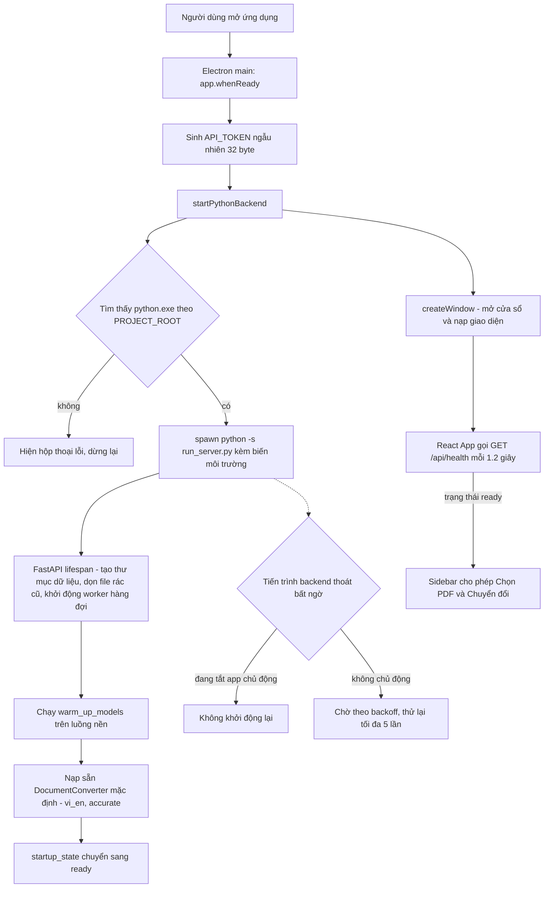

Cửa sổ ứng dụng hiện ra ngay, không chờ backend — giao diện tự polling `/api/health` để hiển thị tiến độ khởi động thật (đang tải model có thể mất vài phút ở lần chạy đầu), thay vì đoán một khoảng thời gian cố định.

### 2.3. Luồng xử lý một yêu cầu chuyển đổi

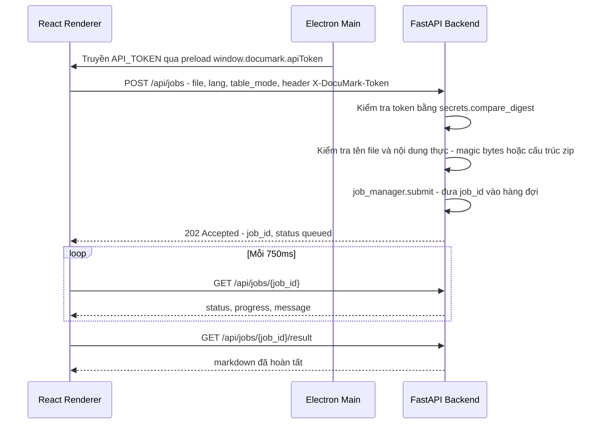

Renderer không giữ kết nối mở chờ backend — nó hỏi lại định kỳ (polling), nên có thể đóng/mở lại tài liệu khác, hủy job, hoặc mất kết nối tạm thời mà không làm treo giao diện. Nếu 5 lần hỏi liên tiếp đều lỗi mạng, giao diện mới báo "mất kết nối" thay vì báo lỗi ngay từ lần đầu.

---

## 3. Lưu đồ thuật toán từng phân hệ

### 3.1. Vòng đời hàng đợi chuyển đổi (Job Queue)

Toàn bộ hệ thống chỉ có **1 worker xử lý tuần tự** (`asyncio.Queue` + 1 task nền), đây là lựa chọn thiết kế có chủ đích để tránh tranh chấp RAM/CPU trên máy cá nhân (xem mục 7.1 và 8).

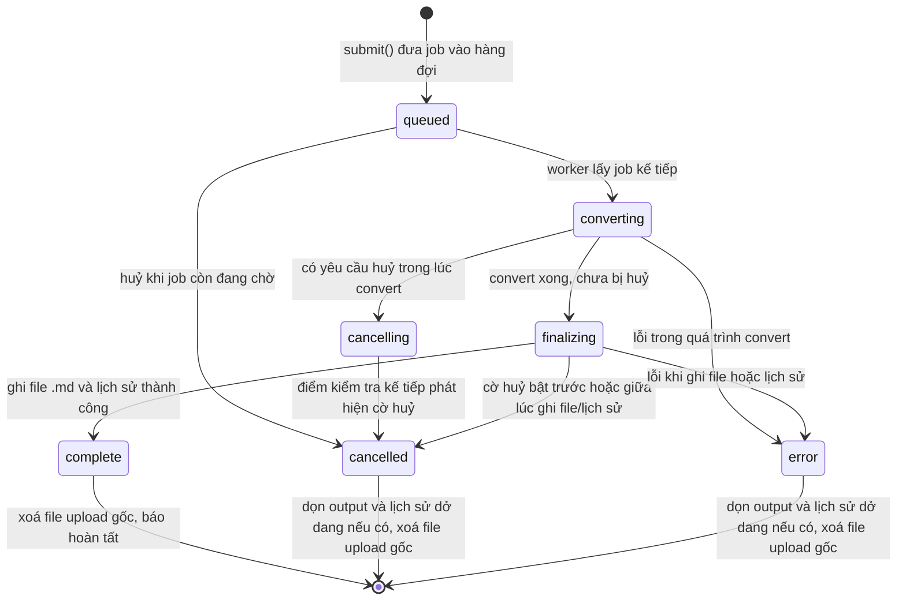

Điểm đáng chú ý về an toàn dữ liệu:
- **Hủy an toàn (cooperative cancellation):** hủy khi job đang `converting`/`finalizing` không giết tiến trình ngay lập tức — chỉ bật cờ `cancel_requested`, job tự kiểm tra cờ này tại các điểm dừng an toàn (sau convert, sau ghi file, sau ghi lịch sử) rồi tự dọn dẹp, tránh để lại file `.md` hoặc bản ghi lịch sử mồ côi.
- **Ghi file nguyên tử (atomic write):** kết quả được ghi ra file tạm, `fsync`, rồi `os.replace` sang tên thật — không bao giờ có file `.md` ghi dở nếu app bị tắt đột ngột giữa chừng.
- **Rollback khi lỗi:** nếu lỗi xảy ra sau khi đã ghi lịch sử nhưng trước khi job hoàn tất, hệ thống tự xóa cả file output lẫn bản ghi lịch sử vừa tạo — không để lại trạng thái nửa vời.
- **Giới hạn bộ nhớ:** tối đa 250 job được giữ trong bộ nhớ (`DOCUMARK_MAX_JOB_RECORDS`) và 200 mục lịch sử trên đĩa (`DOCUMARK_MAX_HISTORY`) — vượt ngưỡng sẽ tự loại bỏ job/lịch sử cũ nhất đã hoàn tất, kèm xóa output tương ứng.

### 3.2. Thuật toán chuyển đổi tài liệu (Docling pipeline)

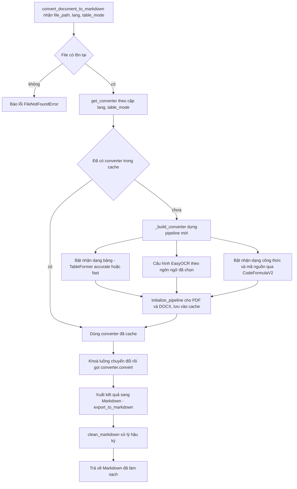

Mỗi tổ hợp (ngôn ngữ OCR, chế độ bảng) cần một `DocumentConverter` riêng vì docling gắn cứng cấu hình này lúc khởi tạo pipeline (không override được theo từng lần gọi). Vì vậy hệ thống **dựng lười (lazy) và cache theo tổ hợp**, chỉ tổ hợp mặc định (`vi_en` + `accurate`) được nạp sẵn ngay lúc khởi động để không giữ nhiều pipeline ML nặng trong RAM cùng lúc.

Với DOCX, docling đọc trực tiếp cấu trúc XML gốc (OOXML) thay vì OCR — bảng biểu giữ nguyên chính xác từ file Word, không qua nhận dạng hình ảnh.

### 3.3. Hậu xử lý Markdown (làm sạch bảng biểu)

Docling đôi khi xuất bảng có cột trống (do ô gộp) hoặc bảng quá phức tạp để hiển thị đẹp dạng Markdown thuần. Module `markdown_cleaner.py` xử lý hậu kỳ theo nguyên tắc **không bao giờ đánh mất nội dung** — mọi phép biến đổi đều tự kiểm chứng trước khi áp dụng, nếu không chắc chắn thì giữ nguyên bảng gốc.

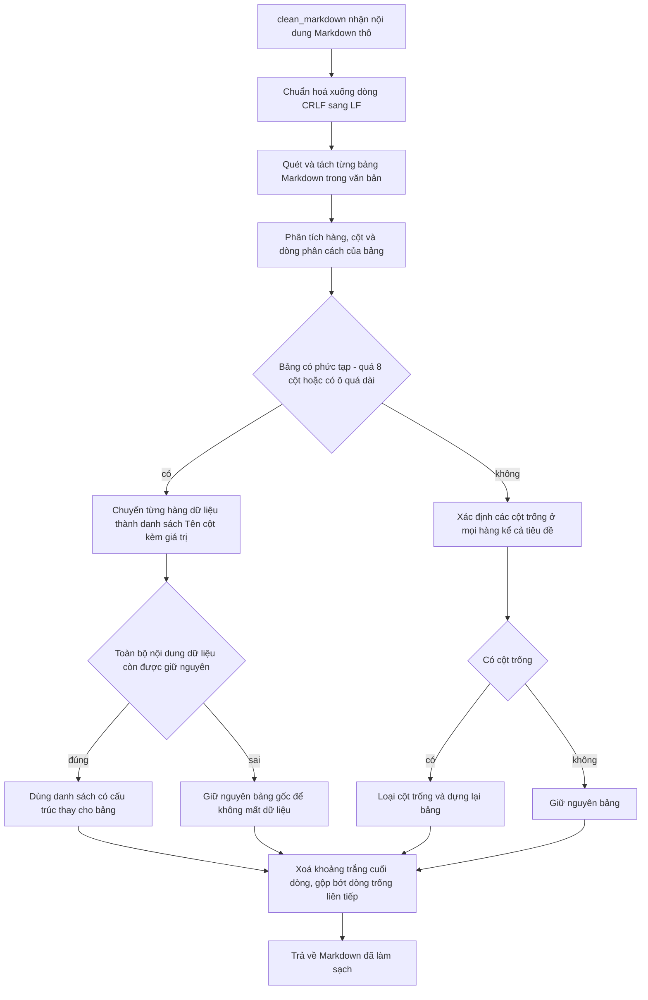

Bước kiểm chứng "Toàn bộ nội dung dữ liệu còn được giữ nguyên" (`_preserves_data_content`) so khớp ngữ nghĩa từng ô dữ liệu gốc với kết quả sau biến đổi trước khi chấp nhận thay bảng — đây là điểm khác biệt so với một bộ làm sạch "cắt gọt mù": nếu phát hiện có khả năng mất dữ liệu (thường do ô gộp phức tạp trong DOCX), hệ thống tự động lùi lại giữ bảng thô thay vì mạo hiểm.

### 3.4. Trích xuất vùng PDF theo lựa chọn (Region OCR)

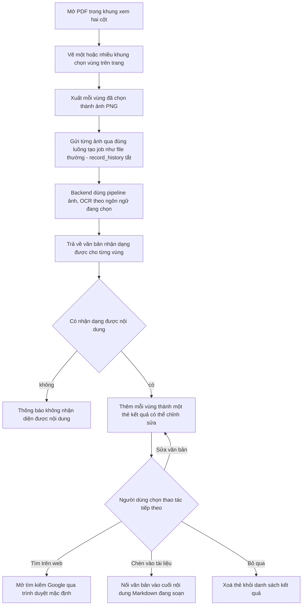

Tính năng này tái sử dụng **cùng một pipeline** `/api/jobs` như chuyển đổi file thường (ảnh PNG đi qua `ImageFormatOption`, cùng cấu hình OCR), chỉ khác ở cờ `record_history=false` — các vùng cắt một-lần này không được lưu vào Lịch sử vì chúng không phải "tài liệu" hoàn chỉnh. Việc mở link tìm kiếm được ủy quyền qua IPC sang tiến trình Electron chính (renderer bị giới hạn quyền, không tự mở URL ngoài), và chỉ chấp nhận URL `http(s)` để tránh bị lợi dụng mở các loại URL nguy hiểm khác.

### 3.5. Xác minh trích dẫn (Citation Verification)

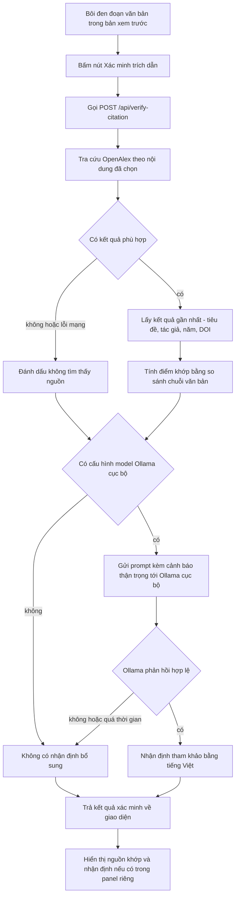

Đây là **tính năng duy nhất trong toàn bộ ứng dụng cần internet**. Cả hai lệnh gọi mạng (OpenAlex, Ollama) đều được thiết kế "best-effort": lỗi mạng, timeout, hay kết quả rỗng đều được nuốt lại và báo "không xác minh được" — không bao giờ trả về lỗi 500 hay quy kết "trích dẫn giả" chỉ vì một lần gọi mạng thất bại. Nhận định của Ollama luôn mang tính **tham khảo, không phải kết luận cuối cùng** — prompt hệ thống yêu cầu model nói rõ khi không chắc chắn thay vì đoán liều.

### 3.6. Dịch máy có che công thức & thuật ngữ (Translation)

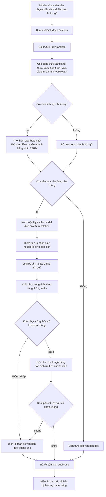

Nguyên lý cốt lõi là **"không bao giờ trả về nội dung bị hỏng"**: nếu sau khi dịch, số lượng hoặc thứ tự nhãn tạm (`FORMULA0`, `TERM0`...) trong kết quả không khớp chính xác với những gì đã che (model có thể làm rơi, nhân đôi, hoặc xáo trộn nhãn), hệ thống **tự động dịch lại từ văn bản gốc không che** thay vì trả về một bản dịch có placeholder bị lộ hoặc công thức sai. Cơ chế này đã được kiểm thử thực tế với model đã đóng gói: dịch đúng và giữ nguyên công thức dạng `$E=hf$`, `$F = ma$` xen giữa câu văn thường.

### 3.7. Giám sát & tự khởi động lại backend (Electron)

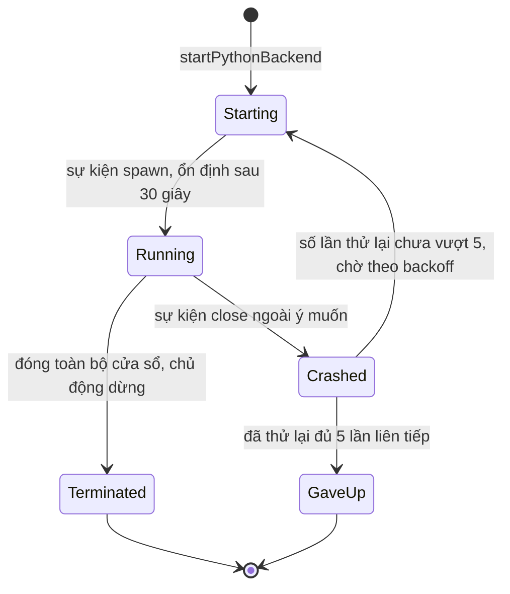

Nếu tiến trình Python chết đột ngột (không phải do người dùng đóng app), Electron tự khởi động lại với thời gian chờ tăng dần theo cấp số nhân (1s, 2s, 4s... tối đa 30s), tối đa 5 lần liên tiếp. Nếu backend chạy ổn định được 30 giây, "ngân sách thử lại" được reset về đầy — một backend thỉnh thoảng chập chờn nhưng phần lớn thời gian hoạt động tốt sẽ không bị khóa vĩnh viễn chỉ vì một chuỗi lỗi trong quá khứ. Khi đóng toàn bộ cửa sổ, Electron chủ động dùng `taskkill /f /t` (Windows) để đảm bảo tiến trình Python và mọi tiến trình con của nó thực sự dừng hẳn, không để sót tiến trình chạy ngầm.

### 3.8. Tự động lưu bản nháp (Autosave)

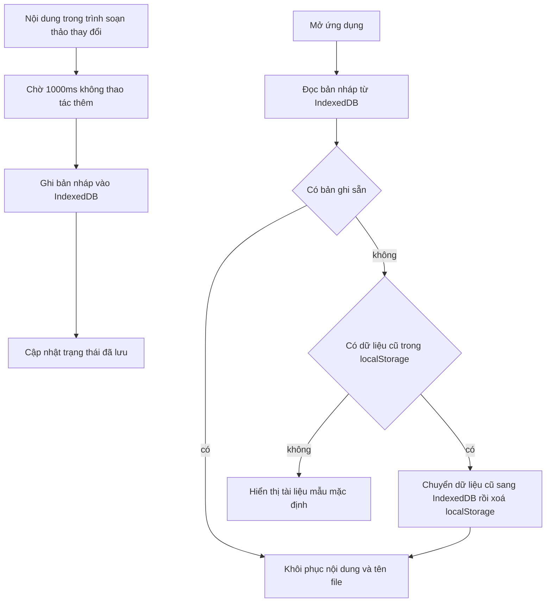

Autosave lưu vào IndexedDB của trình duyệt nội bộ (không phải backend/đĩa cứng qua API) nên hoạt động ngay cả khi backend chưa sẵn sàng. Cơ chế debounce 1 giây tránh ghi liên tục khi người dùng đang gõ. Bản ghi cũ từng lưu ở `localStorage` (phiên bản trước) được tự động di trú sang IndexedDB một lần rồi xóa, để không mất bản nháp dở dang khi nâng cấp ứng dụng.

---

## 4. Tính năng sản phẩm

### 4.1. Chuyển đổi tài liệu (lõi sản phẩm)

- Định dạng đầu vào: `.pdf`, `.docx`, `.pptx`, `.html`/`.htm`, ảnh thông dụng (PNG/JPG/TIFF/BMP...).
- OCR: chọn `vi+en` (mặc định), chỉ `vi`, hoặc chỉ `en`.
- Nhận dạng bảng biểu bằng AI (TableFormer): chế độ `accurate` (chính xác hơn, chậm hơn ~2-3 lần) hoặc `fast`.
- Nhận dạng công thức toán/lý/hóa → xuất LaTeX (`$...$` cho công thức trong dòng, `$$...$$` cho khối), và nhận dạng khối mã nguồn — dùng model `CodeFormulaV2`.
- Hàng đợi xử lý thật: trạng thái `queued → converting → finalizing → complete`, có thể hủy job đang chạy an toàn (xem mục 3.1).
- Tải lên nhiều file cùng lúc, xử lý tuần tự từng file (không song song) — đánh đổi có chủ đích để không tranh chấp RAM/CPU, xem mục 7.1.
- Giới hạn upload 100 MiB/file, chỉ nhận định dạng được hỗ trợ, kiểm tra cả nội dung thực của file (không chỉ tin phần mở rộng).

### 4.2. Trích xuất vùng PDF (OCR theo lựa chọn)

Chọn một vùng bất kỳ trên trang PDF (ví dụ một hình/bảng nhỏ) để OCR riêng vùng đó, không phải chuyển cả file. Kết quả hiện ở panel riêng, có thể sửa văn bản, tìm kiếm trên web, hoặc chèn thẳng vào tài liệu Markdown đang soạn (xem lưu đồ mục 3.4).

### 4.3. Xác minh trích dẫn *(cần internet)*

Bôi đen một đoạn trích dẫn/tuyên bố trong bản xem trước, bấm **"Xác minh trích dẫn"**:
- Tra cứu nguồn khớp gần nhất qua OpenAlex (API học thuật miễn phí, không cần key) — trả về tiêu đề, tác giả, năm, DOI, và điểm khớp (so khớp chuỗi văn bản).
- Nếu người dùng có cấu hình Ollama chạy cục bộ (`DOCUMARK_OLLAMA_URL`/`DOCUMARK_OLLAMA_MODEL`), có thêm nhận định "có vẻ phù hợp hay không" mang tính **tham khảo**, luôn kèm cảnh báo độ tin cậy thấp — không bắt buộc, mặc định tắt.
- Đây là tính năng **duy nhất** trong app cần kết nối mạng. Toàn bộ phần còn lại hoạt động offline hoàn toàn.

### 4.4. Dịch hai chiều Anh ↔ Việt *(chạy offline hoàn toàn)*

Bôi đen một đoạn, chọn chiều dịch (Anh→Việt hoặc Việt→Anh) và tùy chọn lĩnh vực thuật ngữ, bấm **"Dịch đoạn đã chọn"**: dịch bằng model dịch máy cục bộ, không gọi mạng.

- **4 lựa chọn lĩnh vực thuật ngữ chuyên ngành** (có thể để trống = dùng bản dịch chung): Khoa học máy tính/AI-ML (36 thuật ngữ), Toán-Lý-Hóa (36 thuật ngữ), Kinh tế/Khoa học xã hội (30 thuật ngữ) — ép model dùng đúng thuật ngữ học thuật tiếng Việt thay vì bản dịch chung chung, thiếu nhất quán.
- Công thức/khối mã trong đoạn được che tạm trước khi dịch và khôi phục nguyên vẹn sau đó; nếu việc khôi phục không khớp, tự động dịch lại theo cách an toàn (không bao giờ trả về công thức bị hỏng hoặc mất nội dung) — xem lưu đồ mục 3.6.
- Đã kiểm thử thực tế trong phiên làm việc với model đã đóng gói — dịch đúng, giữ nguyên công thức `$E=hf$`, `$F = ma$` trong câu tiếng Anh có công thức xen giữa văn bản thường.
- Phạm vi hiện tại: chỉ dịch đoạn được người dùng chọn (không dịch nguyên văn bản một lần).

### 4.5. Lịch sử & lưu trữ

Danh sách các lần chuyển đổi trước, mở lại output cũ, xóa mục không cần. Dữ liệu lưu tại thư mục dữ liệu ứng dụng của Windows (`%APPDATA%\mark-tini\data`), tách biệt hoàn toàn khỏi thư mục cài đặt.

### 4.6. Soạn thảo & thao tác tài liệu

- Trình soạn thảo Markdown với 3 chế độ xem: chỉ soạn thảo, soạn thảo + xem trước song song, chỉ xem trước.
- Tự động lưu bản nháp mỗi khi có thay đổi (debounce 1 giây, lưu vào IndexedDB — xem mục 3.8), không mất nội dung khi tắt app đột ngột hoặc mất điện.
- Mở file Markdown có sẵn để chỉnh sửa tiếp; tạo tài liệu mới (có hỏi lưu nếu đang có nội dung chưa lưu).
- Lưu kết quả ra file `.md` tải về máy; sao chép toàn bộ nội dung vào clipboard.

---

## 5. Các dịch vụ backend & danh sách API

### 5.1. Thành phần backend đi kèm hệ thống

| Thành phần | Vai trò | Đóng gói cùng app? |
|---|---|---|
| Python runtime (chuẩn, độc lập) | Chạy toàn bộ backend, không cần cài Python hệ thống | Có — đóng gói sẵn (~1,6 GB) |
| FastAPI + Uvicorn | Máy chủ API nội bộ, lắng nghe `127.0.0.1:8088` | Có |
| Docling (`document_converter`) | Engine phân tích layout, bảng biểu, OCR, công thức/mã nguồn | Có |
| EasyOCR | Công cụ OCR nhận dạng chữ trong ảnh/trang scan | Có (gói ngôn ngữ vi+en) |
| Model dịch máy (`VietAI/envit5-translation`) | Dịch máy Anh↔Việt cục bộ | Có |
| Hàng đợi công việc (`ConversionJobManager`) | Điều phối job chuyển đổi tuần tự, trong tiến trình, không phải service riêng | Có (mã nguồn nội bộ) |
| Dịch vụ lịch sử (`history_service`) | Lưu/đọc lịch sử dạng file JSON, ghi nguyên tử, khóa luồng | Có (không dùng database engine) |
| Hệ thống log (`logging_utils`) | Log xoay vòng theo dung lượng + gắn mã tương quan theo từng request | Có |
| OpenAlex API | Tra cứu học thuật cho tính năng xác minh trích dẫn | **Không** — dịch vụ ngoài, cần internet |
| Ollama (tùy chọn) | Model ngôn ngữ cục bộ cho nhận định trích dẫn tham khảo | **Không** — người dùng tự cài/chạy riêng, app chỉ gọi tới nếu được cấu hình |

Toàn bộ backend chạy trong **một tiến trình Python duy nhất**, không có microservice, không có database server (SQL/NoSQL) — trạng thái được giữ trong bộ nhớ tiến trình (job đang chạy) và file JSON trên đĩa (lịch sử).

### 5.2. Danh sách API endpoint

Tiền tố chung: `http://127.0.0.1:8088`. Trừ `GET /api/session`, mọi endpoint dưới `/api/*` đều yêu cầu header `X-DocuMark-Token` hợp lệ.

| Phương thức | Đường dẫn | Xác thực | Chức năng |
|---|---|---|---|
| GET | `/api/session` | Kiểm tra Origin | Cấp token phiên cho renderer chạy ở chế độ trình duyệt/dev (không lộ token cross-origin) |
| GET | `/api/health` | Có | Trạng thái khởi động backend: `starting` / `loading_models` / `ready` / `error` |
| POST | `/api/jobs` | Có | Tạo job chuyển đổi mới (multipart: `file`, `lang`, `table_mode`, `record_history`) → 202 + trạng thái job |
| GET | `/api/jobs/{job_id}` | Có | Lấy trạng thái job hiện tại (dùng để polling tiến độ) |
| GET | `/api/jobs/{job_id}/result` | Có | Lấy Markdown kết quả khi job đã `complete` (409 nếu chưa sẵn sàng) |
| DELETE | `/api/jobs/{job_id}` | Có | Yêu cầu hủy job (hủy ngay nếu còn `queued`, hủy an toàn nếu đang chạy) |
| POST | `/api/convert` | Có | Endpoint tương thích cũ — chờ tới khi job xong rồi trả kết quả trực tiếp (không polling) |
| GET | `/api/download/{job_id}` | Có | Tải file `.md` kết quả, đặt lại tên theo tên file gốc |
| GET | `/api/history` | Có | Danh sách lịch sử chuyển đổi |
| GET | `/api/history/{job_id}` | Có | Chi tiết 1 mục lịch sử kèm nội dung Markdown đầy đủ |
| DELETE | `/api/history/{job_id}` | Có | Xóa mục lịch sử và file output liên quan |
| POST | `/api/verify-citation` | Có | Xác minh trích dẫn qua OpenAlex + Ollama tùy chọn — **cần internet** |
| POST | `/api/translate` | Có | Dịch đoạn văn bản đã chọn — offline hoàn toàn |

### 5.3. Bảo mật & xác thực

- **Token phiên theo từng lần mở app:** Electron sinh một token ngẫu nhiên 32 byte (base64url) mỗi lần khởi động, truyền cho backend qua biến môi trường và cho renderer qua tham số khởi chạy cửa sổ (`additionalArguments`). So khớp token dùng `secrets.compare_digest` (chống timing attack).
- **Chỉ lắng nghe localhost:** backend bind `127.0.0.1`, không phải `0.0.0.0` — thiết bị khác trong cùng mạng LAN/Wi-Fi không thể gọi tới API này.
- **Allowlist Origin cho bootstrap token:** `/api/session` (endpoint duy nhất không yêu cầu token sẵn) chỉ phục vụ các Origin nằm trong danh sách tin cậy (`DOCUMARK_TRUSTED_ORIGINS`), tránh trang web bất kỳ lấy được token qua trình duyệt.
- **Kiểm tra nội dung file thực tế, không chỉ tin phần mở rộng:** mọi file tải lên được kiểm tra magic bytes (PDF/PNG/JPG/TIFF/BMP) hoặc cấu trúc thành phần bắt buộc bên trong file zip OOXML (DOCX/PPTX) trước khi đưa vào pipeline xử lý — một file đổi tên đuôi giả mạo sẽ bị từ chối với lỗi 415.
- **An toàn tên file:** tên file gốc được chuẩn hóa và kiểm tra độ dài trước khi dùng, file lưu trên đĩa luôn dùng UUID làm tên (không dùng trực tiếp tên người dùng đặt) để tránh path traversal.
- **Renderer không có quyền hệ thống trực tiếp:** `contextIsolation: true`, `nodeIntegration: false`, `sandbox: true`; mọi hành động cần quyền hệ thống (mở URL ngoài) phải đi qua kênh IPC được giới hạn chặt (chỉ nhận URL `http(s)`).

### 5.4. Ghi log & truy vết (observability)

- Mỗi request HTTP được gán một mã tương quan (correlation ID) ngắn (12 ký tự hex), trả về qua header `X-Request-ID` và gắn vào mọi dòng log liên quan tới request đó — người dùng báo lỗi có thể cung cấp mã này để tra thẳng ra log tương ứng thay vì đoán theo thời gian.
- Log ghi song song ra console và file `backend.log` xoay vòng (tối đa 5 MB/file, giữ tối đa 5 file cũ) tại thư mục `%APPDATA%\mark-tini\data\logs`.
- Middleware ghi log tóm tắt mỗi request: phương thức, đường dẫn, mã trạng thái, thời gian xử lý (ms).

---

## 6. Model AI đang sử dụng

Tất cả chạy **cục bộ, trên CPU** (không cần GPU/CUDA — đã xác nhận qua log runtime: `Accelerator device: 'cpu'` cho toàn bộ pipeline). Model được tải sẵn vào bộ cài đặt, không tải gì thêm khi dùng (trừ tính năng xác minh trích dẫn gọi API, không phải model AI cục bộ).

| Model | Vai trò | Nguồn |
|---|---|---|
| `docling-project/docling-layout-heron` | Phân tích bố cục trang (vùng văn bản, bảng, hình...) | Docling project (HuggingFace) |
| `docling-project/docling-models` (TableFormer v2.3.0) | Nhận dạng cấu trúc bảng biểu | Docling project |
| `docling-project/CodeFormulaV2` | Nhận dạng công thức toán/lý/hóa và khối mã nguồn (vision-language model) | Docling project |
| EasyOCR (gói `vi`+`en`) | OCR nhận dạng chữ trong ảnh/trang scan | EasyOCR 1.7.2 |
| `VietAI/envit5-translation` | Dịch máy Anh↔Việt (T5, checkpoint song hướng) | VietAI (HuggingFace) |

Tổng dung lượng bundle model: **~2.3 GB** (2278 MiB / 77 file, đã xác nhận qua bước validate của script đóng gói).

---

## 7. Thông số kỹ thuật & cấu hình

### 7.1. Yêu cầu cấu hình máy

Số liệu RAM dưới đây **đo thực tế** trong một phiên chạy runtime đã đóng gói, theo dõi bộ nhớ tiến trình (RSS) qua từng bước khởi động thật:

| Giai đoạn | RAM tiến trình backend |
|---|---|
| Vừa khởi động Python, chưa nạp gì | ~26 MB |
| Sau khi nạp thư viện lõi (FastAPI, Docling, EasyOCR) | ~335 MB |
| Sau khi nạp đủ model mặc định (layout + bảng + công thức/mã + OCR) — **xảy ra tự động mỗi lần mở app** | ~1.43 GB |
| Sau khi dùng thêm tính năng dịch ít nhất 1 lần (model dịch nạp lười, chỉ khi bấm dùng) | ~2.48 GB |

Cộng thêm phần Electron/Chromium hiển thị giao diện (thường 200–500 MB) và bản thân Windows, khuyến nghị:

- **RAM: tối thiểu 8 GB, khuyến nghị 16 GB** để chạy mượt cùng lúc với các ứng dụng khác.
- **CPU: bất kỳ CPU x64 hiện đại nào** — không cần GPU rời/CUDA. Vì chạy trên CPU nên tốc độ xử lý file PDF nhiều trang/nhiều công thức sẽ chậm hơn dịch vụ cloud có GPU; nên đo trực tiếp bằng tài liệu thật của khách hàng ở bước test cài đặt (mục 9).
- **Ổ đĩa:** file cài đặt ~1,9 GB, sau khi cài chiếm **~4,3 GB** (gồm runtime Python đóng gói ~1,6 GB + model AI ~2,3 GB + ứng dụng). Nên còn trống tối thiểu **6 GB**.
- **Hệ điều hành:** Windows 10/11 64-bit.
- **Mạng:** không bắt buộc để cài đặt hoặc dùng tính năng chính. Chỉ cần mạng khi dùng "Xác minh trích dẫn".
- **Quyền cài đặt:** không cần quyền quản trị (admin) — cài theo user hiện tại, không có UAC.

### 7.2. Cấu hình qua biến môi trường

Backend đọc cấu hình từ biến môi trường (module `config.py`), có giá trị mặc định an toàn nếu không đặt. Trong bản đóng gói, Electron tự đặt các biến quan trọng — người dùng cuối không cần chỉnh gì; bảng dưới đây phục vụ mục đích kỹ thuật/vận hành nâng cao.

| Biến môi trường | Giá trị mặc định | Ý nghĩa |
|---|---|---|
| `DOCUMARK_DATA_DIR` | `<project>/data` (Electron đặt thành `%APPDATA%\mark-tini\data`) | Thư mục chứa upload tạm, output, lịch sử, log |
| `DOCUMARK_API_TOKEN` | sinh ngẫu nhiên nếu không đặt | Token xác thực API |
| `DOCUMARK_TRUSTED_ORIGINS` | `127.0.0.1:8088`, `localhost:8088`, `127.0.0.1:5173`, `localhost:5173` | Origin được phép lấy token qua `/api/session` |
| `DOCUMARK_CORS_ORIGINS` | = trusted origins + `null` | Origin được phép gọi CORS |
| `DOCUMARK_MAX_UPLOAD_MIB` | 100 | Giới hạn dung lượng 1 file tải lên (MiB) |
| `DOCUMARK_MAX_HISTORY` | 200 | Số mục lịch sử tối đa giữ trên đĩa |
| `DOCUMARK_MAX_JOB_RECORDS` | 250 | Số bản ghi job tối đa giữ trong bộ nhớ |
| `DOCUMARK_LOG_LEVEL` | `INFO` | Mức log |
| `DOCUMARK_OFFLINE_MODE` | tắt (Electron bật `1` khi đóng gói) | Bắt buộc chạy hoàn toàn offline, không cho phép tải model từ mạng |
| `DOCLING_ARTIFACTS_PATH` | không đặt (Electron trỏ vào `offline_models`) | Đường dẫn model AI đã đóng gói sẵn |
| `DOCUMARK_TRANSLATION_MODEL_PATH` | không đặt (Electron trỏ vào `offline_models/translation`) | Đường dẫn model dịch cục bộ đã đóng gói |
| `DOCUMARK_TRANSLATION_MODEL` | `VietAI/envit5-translation` | ID model dịch dùng khi không có bản cục bộ |
| `DOCUMARK_OLLAMA_URL` | `http://127.0.0.1:11434` | Địa chỉ Ollama cục bộ cho nhận định trích dẫn |
| `DOCUMARK_OLLAMA_MODEL` | không đặt (= tắt tính năng nhận định) | Tên model Ollama dùng cho nhận định tham khảo |

Backend cố định lắng nghe tại **`127.0.0.1:8088`** (không cấu hình được qua biến môi trường — đặt cứng trong `run_server.py` vì đây là ứng dụng desktop 1 người dùng, không phải dịch vụ mạng).

---

## 8. Tính ứng dụng

- **Đối tượng chính:** người đọc/nghiên cứu tài liệu khoa học tiếng Anh, cần bản Markdown chỉnh sửa được, giữ đúng bảng/công thức/mã thay vì OCR thô làm hỏng cấu trúc.
- **Offline-first:** phù hợp môi trường không có/hạn chế internet, hoặc dữ liệu nhạy cảm không muốn rời khỏi máy — chỉ 1 tính năng phụ (xác minh trích dẫn) cần mạng, và người dùng chủ động bật từng lần.
- **Máy đơn, một người dùng:** đây là ứng dụng desktop cài trên từng máy, không phải server nhiều người dùng cùng lúc. Xử lý tuần tự từng file (không song song) là lựa chọn thiết kế để an toàn RAM/CPU trên máy cá nhân, không phải giới hạn kỹ thuật tạm thời.
- **Ngôn ngữ Việt được ưu tiên:** OCR vi+en, dịch hai chiều Anh↔Việt với thuật ngữ chuyên ngành, toàn bộ UI tiếng Việt — nhắm đúng nhu cầu người dùng Việt Nam đọc/viết tài liệu tiếng Anh học thuật.
- **Phù hợp quy trình nghiên cứu:** trích xuất nhanh nội dung từ hình/bảng trong PDF để tra cứu thêm, xác minh độ tin cậy của trích dẫn trước khi dùng lại, dịch nhanh đoạn khó hiểu mà không rời khỏi tài liệu đang đọc.

---

## 9. Hướng dẫn cài đặt và chạy test trên máy khách hàng

### Bước 1 — Nhận file và kiểm tra toàn vẹn

File cài đặt: **`Mark Tini Setup 1.2.0.exe`** (~1,9 GB)

Sau khi copy sang máy khách hàng (USB, mạng nội bộ...), mở PowerShell hoặc cmd tại thư mục chứa file, chạy:

```powershell
certutil -hashfile "Mark Tini Setup 1.2.0.exe" SHA256
```

Kết quả phải khớp chính xác với hash của bản build đang phát hành (mỗi lần build lại sẽ cho ra hash khác — kiểm tra với hash đi kèm bản cụ thể được bàn giao, ví dụ bản build cục bộ mới nhất trong phiên này:

```
30422A9E7C1338C5D5A7F6ED6FEBA157B1980162B2CEB23487986F448F2804B1
```

(Không khớp = file bị hỏng/thiếu khi copy — copy lại, đừng cài.)

### Bước 2 — Cài đặt

- Double-click file `.exe`, không cần quyền admin, không có bước wizard (cài 1 click).
- Không cần mạng trong lúc cài — mọi thứ (runtime, model AI) đã đóng gói sẵn trong file.
- Cài xong, shortcut xuất hiện trên Desktop/Start Menu.

### Bước 3 — Mở lần đầu

- Nên tắt Wi-Fi/rút mạng trước khi mở, để kiểm tra đúng nghĩa "chạy offline thật".
- App mở lên trong vài giây (model đã có sẵn cục bộ, không phải tải từ mạng). Không được có lỗi kiểu "Python executable not found" hoặc "Offline models not found".

### Bước 4 — Test chuyển đổi với tài liệu thật

Dùng 1 file PDF và 1 file DOCX thật của khách hàng (ưu tiên loại có bảng, công thức, hoặc đoạn in đậm để test đầy đủ):

- Convert PDF/DOCX, xác nhận Markdown giữ đúng bảng, chữ đậm, công thức (nếu có).
- Thử hủy 1 job đang chạy — job dừng ngay trong UI.
- Ghi lại thời gian xử lý thực tế (đây là số liệu benchmark tốc độ thật trên phần cứng của khách hàng, hiện báo cáo này chưa có).

### Bước 5 — Test dịch (vẫn đang tắt mạng)

Bôi đen 1 đoạn có công thức trong bản xem trước, thử cả 2 chiều dịch và ít nhất 1 lĩnh vực thuật ngữ — phải dịch thành công dù không có mạng, công thức giữ nguyên không bị dịch/mất.

### Bước 6 — Test xác minh trích dẫn (bật lại mạng)

Bôi đen 1 đoạn có trích dẫn thật, bấm "Xác minh trích dẫn" — xác nhận có kết quả khi có mạng. Đây là tính năng duy nhất cần internet nên là bước cuối cùng cần bật mạng lại.

### Bước 7 — Vị trí lưu dữ liệu

Sau khi convert, kiểm tra `%APPDATA%\mark-tini\data` có chứa output — không nằm trong thư mục cài đặt (`Program Files`), không liên quan thư mục dự án gốc.

### Nếu có lỗi

Chụp lại dialog lỗi, mở app từ terminal (thay vì double-click) để xem log chi tiết hơn nếu có thể, ghi lại: bước nào fail, thông báo lỗi, phiên bản Windows của máy test. Có thể tra theo mã `X-Request-ID` trong `%APPDATA%\mark-tini\data\logs\backend.log` nếu lỗi xảy ra ở tầng API.

*(Checklist đầy đủ hơn, dùng cho QA nội bộ, nằm tại [`.viepilot/phases/phase-8-reliability-security-offline/CLEAN-MACHINE-VERIFICATION.md`](../.viepilot/phases/phase-8-reliability-security-offline/CLEAN-MACHINE-VERIFICATION.md).)*

---

## 10. Hướng dẫn sử dụng nhanh

Hướng dẫn sử dụng đầy đủ dành cho người dùng cuối được lưu riêng tại file `HDSD.marktini` trên Desktop. Tóm tắt nhanh các thao tác chính:

1. **Chuyển đổi tài liệu:** Sidebar → *Chọn PDF & Chuyển đổi* → chọn file (có thể chọn nhiều file cùng lúc) → chờ xử lý → nội dung Markdown hiện trong khung soạn thảo.
2. **Chọn ngôn ngữ OCR / chế độ bảng:** 2 ô chọn ngay dưới nút tải file trong Sidebar, áp dụng cho lần chuyển đổi tiếp theo.
3. **Trích xuất vùng PDF:** khi mở file PDF, khung xem PDF hiện bên trái — vẽ khung chọn vùng cần OCR riêng, xem kết quả ở panel dưới khung xem.
4. **Xác minh trích dẫn:** bôi đen đoạn văn bản trong khung xem trước → nút *Xác minh trích dẫn* trên thanh công cụ (cần mạng).
5. **Dịch đoạn văn bản:** bôi đen đoạn → chọn chiều dịch/lĩnh vực thuật ngữ → nút *Dịch đoạn đã chọn* (không cần mạng).
6. **Lưu kết quả:** nút *Lưu file* (thanh công cụ) tải file `.md` về máy; nút *Sao chép* copy toàn bộ nội dung.
7. **Lịch sử:** danh sách các lần chuyển đổi trước ở cuối Sidebar, click để mở lại, biểu tượng thùng rác để xóa.
8. **Tài liệu mới / Mở file Markdown:** trong nhóm *Chức năng* của Sidebar.

---

## 11. Trạng thái hiện tại & giới hạn đã biết

**Đã hoàn thành:**
- 48/48 unit test backend pass, `tsc`/`eslint` sạch, `npm audit` production 0 vulnerability.
- Đã build và validate offline thật (nạp model, dịch thử, convert thử) — không chỉ đọc code.
- Bug đóng gói model dịch (PowerShell nuốt dấu ngoặc kép) đã phát hiện và fix qua build thật, không phải đoán.
- Bug nghiêm trọng: app không mở được sau khi cài (crash ngay khi khởi động do xung đột định dạng module ESM/CommonJS khi đóng gói Electron main process) — phát hiện qua cài đặt thật trên máy, đã fix và verify lại toàn bộ luồng cài đặt → mở app → convert tài liệu → lưu đúng vị trí.
- Dịch máy đã mở rộng thành hai chiều (Anh↔Việt) kèm 3 bộ từ điển thuật ngữ chuyên ngành (102 thuật ngữ), thay cho bản chỉ dịch một chiều Anh→Việt trước đây.

**Còn lại — cần khách hàng/người test xác nhận:**
- Chưa có ai chạy cài đặt này trên một máy Windows hoàn toàn sạch (chưa từng cài Python/Node/IDE dev) — đây chính là mục đích của hướng dẫn ở mục 9.
- Chưa có số liệu tốc độ chuyển đổi thật trên tài liệu khoa học nhiều trang — nên đo trong lúc test.

**Giới hạn có chủ đích (không phải lỗi):**
- Xử lý 1 file tại 1 thời điểm (không song song) — lựa chọn thiết kế để an toàn RAM/CPU trên máy cá nhân.
- Dịch chỉ theo đoạn được chọn (không dịch nguyên văn bản tài liệu trong 1 lần bấm).
- Xác minh trích dẫn là gợi ý tham khảo (so khớp gần đúng), không phải xác nhận tuyệt đối — đặc biệt phần nhận định của Ollama (nếu bật) luôn cảnh báo độ tin cậy thấp.
- Ollama không được đóng gói cùng ứng dụng — đây là phần mềm ngoài, người dùng tự cài nếu muốn dùng nhận định trích dẫn bằng LLM cục bộ.
