# Báo cáo kỹ thuật — Tini Suite v1.6.0

Ngày lập báo cáo: 24/08/2026
Phiên bản: 1.6.0 (rebrand Tini Suite — một bộ cài tạo hai ứng dụng Mark Tini và Tini OCR dùng chung Tini Core; thêm xuất Word chỉnh sửa được với ảnh/sơ đồ nhúng thật, Tini OCR nhận dạng ảnh thật, chọn cả thư mục, cùng các bản vá 1.3.1–1.5.0 về PDF dài, lịch sử tài liệu gốc, và hạ tầng E2E)

---

## Mục lục

1. [Tổng quan dự án](#1-tổng-quan-dự-án)
2. [Kiến trúc hệ thống](#2-kiến-trúc-hệ-thống)
3. [Lưu đồ thuật toán từng phân hệ](#3-lưu-đồ-thuật-toán-từng-phân-hệ)
4. [Tính năng sản phẩm](#4-tính-năng-sản-phẩm)
5. [Các dịch vụ backend & danh sách API](#5-các-dịch-vụ-backend--danh-sách-api)
6. [Model AI đang sử dụng](#6-model-ai-đang-sử-dụng)
7. [Thông số kỹ thuật & cấu hình](#7-thông-số-kỹ-thuật--cấu-hình)
8. [Tính ứng dụng](#8-tính-ứng-dụng)
9. [Hướng dẫn cài đặt và chạy test trên máy khách hàng](#9-hướng-dẫn-cài-đặt-và-chạy-test-trên-máy-khách-hàng)
10. [Hướng dẫn sử dụng nhanh](#10-hướng-dẫn-sử-dụng-nhanh)
11. [Trạng thái hiện tại & giới hạn đã biết](#11-trạng-thái-hiện-tại--giới-hạn-đã-biết)

---

## 1. Tổng quan dự án

**Tini Suite** là bộ công cụ desktop cho Windows, gồm **hai ứng dụng riêng** cài từ chung một bộ cài đặt:

- **Mark Tini** — chuyển tài liệu (PDF, DOCX, PPTX, HTML, ảnh) sang Markdown chỉnh sửa được, hoặc xuất thẳng ra Word.
- **Tini OCR** — nhận dạng chữ trong nhiều ảnh chụp/scan cùng lúc, cho review theo từng trang rồi xuất TXT/Markdown/Word.

Toàn bộ xử lý AI chạy **cục bộ trên máy người dùng** — không upload tài liệu lên server nào, không cần tài khoản, không cần internet cho luồng chuyển đổi/OCR/dịch/xuất Word chính. Hai ứng dụng là **hai cửa sổ Electron riêng của cùng một gói cài đặt**, dùng chung một tiến trình backend FastAPI duy nhất thông qua lớp điều phối **Tini Core** (xem mục 2 và 3.7) — người dùng có thể mở cả hai cùng lúc mà không tốn thêm RAM cho một bản backend/model thứ hai.

Ứng dụng nhắm tới người dùng làm việc với tài liệu khoa học/kỹ thuật tiếng Anh (nghiên cứu sinh, nhà nghiên cứu) và người cần số hoá ảnh chụp tài liệu: giữ nguyên bảng biểu, công thức toán/lý/hóa, khối mã nguồn khi chuyển sang Markdown/Word, và bổ sung thêm các công cụ hỗ trợ đọc hiểu (dịch, xác minh trích dẫn) ngay trong luồng làm việc.

**Kiến trúc tổng quát:**

```
Mark Tini / Tini OCR (Electron) ── Tini Core ── token + HTTP ──> FastAPI (Python) ──> hàng đợi ──> Docling / EasyOCR / model AI
```

- Giao diện và backend đóng gói chung trong 1 file cài đặt, không cần người dùng cài Python/Node riêng.
- Backend chỉ lắng nghe trên `127.0.0.1:8088` (localhost), có token phiên riêng cho mỗi vòng đời backend — tiến trình khác trên máy không gọi được API này.
- Toàn bộ các tầng (Electron ×2, React ×2, FastAPI dùng chung) chạy trong cùng 1 máy, không có thành phần server-side nào bên ngoài máy người dùng, trừ 2 lời gọi mạng tùy chọn (OpenAlex, Ollama cục bộ — xem mục 5.1).

---

## 2. Kiến trúc hệ thống

### 2.1. Sơ đồ thành phần

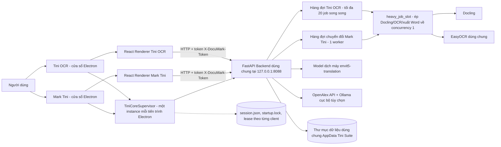

Mỗi ứng dụng (Mark Tini hoặc Tini OCR) là một cửa sổ Electron độc lập, nhưng cả hai nạp cùng một module `TiniCoreSupervisor` để "gắn vào" (attach) một backend FastAPI dùng chung thay vì tự khởi động backend riêng. Instance nào mở trước sẽ thắng cuộc đua giành quyền khởi động (xem mục 3.7); instance mở sau chỉ đọc `session.json` để lấy token và cổng rồi dùng lại. React không gọi trực tiếp vào Electron/Node — mọi thao tác nghiệp vụ đều đi qua HTTP tới backend, với `contextIsolation: true`, `nodeIntegration: false`, `sandbox: true` để giới hạn quyền của renderer.

### 2.2. Luồng khởi động ứng dụng

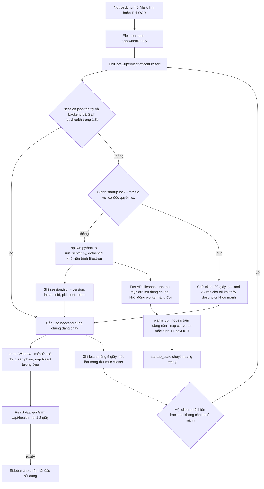

Cửa sổ ứng dụng hiện ra ngay, không chờ backend — giao diện tự polling `/api/health` để hiển thị tiến độ khởi động thật (đang tải model có thể mất vài phút ở lần chạy đầu), thay vì đoán một khoảng thời gian cố định. Nếu mở Tini OCR trong khi Mark Tini đã chạy (hoặc ngược lại), cửa sổ thứ hai gắn vào backend có sẵn gần như tức thì — không phải nạp lại model.

### 2.3. Luồng xử lý một yêu cầu chuyển đổi

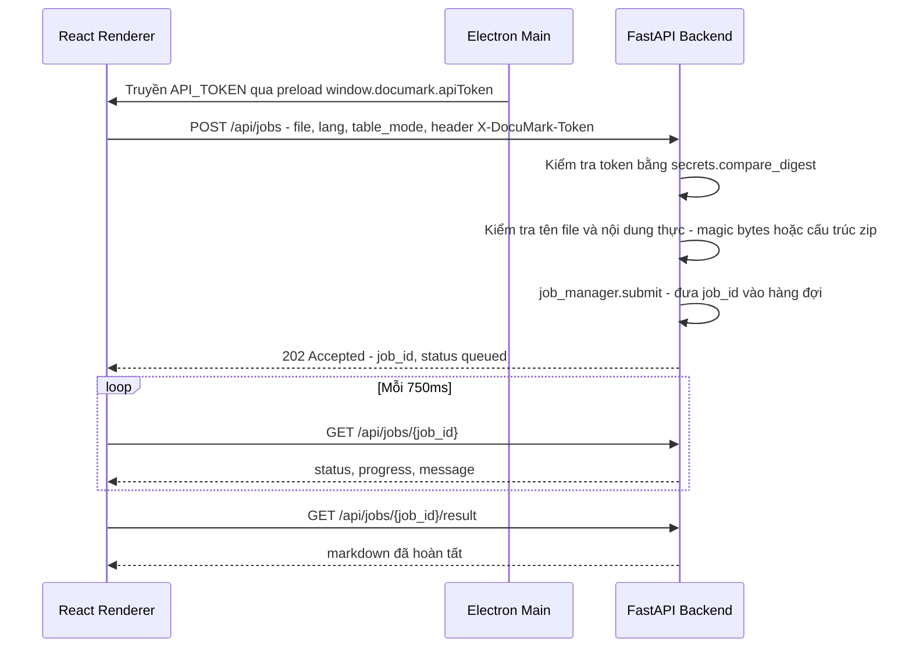

Renderer không giữ kết nối mở chờ backend — nó hỏi lại định kỳ (polling), nên có thể đóng/mở lại tài liệu khác, hủy job, hoặc mất kết nối tạm thời mà không làm treo giao diện. Nếu 5 lần hỏi liên tiếp đều lỗi mạng, giao diện mới báo "mất kết nối" thay vì báo lỗi ngay từ lần đầu. Luồng OCR ảnh của Tini OCR (`POST /api/ocr/jobs` → polling `GET /api/ocr/jobs/{job_id}`) theo đúng khuôn mẫu này, chỉ khác là nhận nhiều file ảnh trong một job thay vì một tài liệu.

---

## 3. Lưu đồ thuật toán từng phân hệ

### 3.1. Vòng đời hàng đợi chuyển đổi (Job Queue — Mark Tini)

Hàng đợi Mark Tini vẫn chỉ có **1 worker xử lý tuần tự** (`asyncio.Queue` + 1 task nền), đây là lựa chọn thiết kế có chủ đích để tránh tranh chấp RAM/CPU trên máy cá nhân (xem mục 7.1 và 8) — không đổi từ v1.3.0. Hàng đợi Tini OCR dùng mô hình khác (thread-pool có trần đồng thời, xem mục 3.10) vì đặc thù khối lượng công việc nhỏ hơn theo từng ảnh.

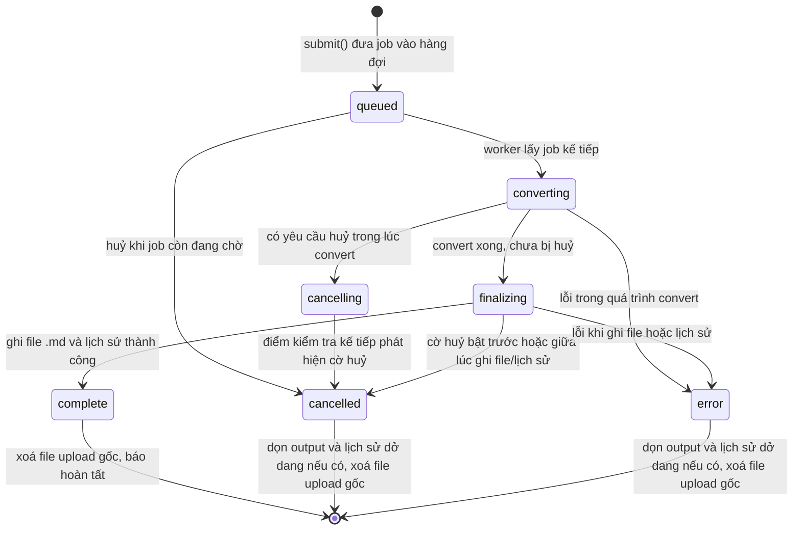

Điểm đáng chú ý về an toàn dữ liệu:
- **Hủy an toàn (cooperative cancellation):** hủy khi job đang `converting`/`finalizing` không giết tiến trình ngay lập tức — chỉ bật cờ `cancel_requested`, job tự kiểm tra cờ này tại các điểm dừng an toàn rồi tự dọn dẹp, tránh để lại file `.md` hoặc bản ghi lịch sử mồ côi.
- **Ghi file nguyên tử (atomic write):** kết quả được ghi ra file tạm, `fsync`, rồi `os.replace` sang tên thật — không bao giờ có file `.md` ghi dở nếu app bị tắt đột ngột giữa chừng.
- **Rollback khi lỗi:** nếu lỗi xảy ra sau khi đã ghi lịch sử nhưng trước khi job hoàn tất, hệ thống tự xóa cả file output lẫn bản ghi lịch sử vừa tạo — không để lại trạng thái nửa vời.
- **Giới hạn bộ nhớ:** tối đa 250 job giữ trong bộ nhớ (`DOCUMARK_MAX_JOB_RECORDS`) và 200 mục lịch sử trên đĩa (`DOCUMARK_MAX_HISTORY`) — vượt ngưỡng sẽ tự loại bỏ job/lịch sử cũ nhất đã hoàn tất.
- **Chống nghẽn PDF dài** *(mới từ v1.4.x)*: PDF nhiều trang được xử lý theo từng cụm trang thay vì nạp một khối; một cụm lỗi không kéo sập toàn bộ job — trang lỗi được tự "cứu" và job chỉ báo hoàn tất sau khi đã kiểm tra đủ số trang, khắc phục lỗi cũ khiến PDF 128+ trang bị lưu thiếu do `std::bad_alloc`.

### 3.2. Thuật toán chuyển đổi tài liệu (Docling pipeline)

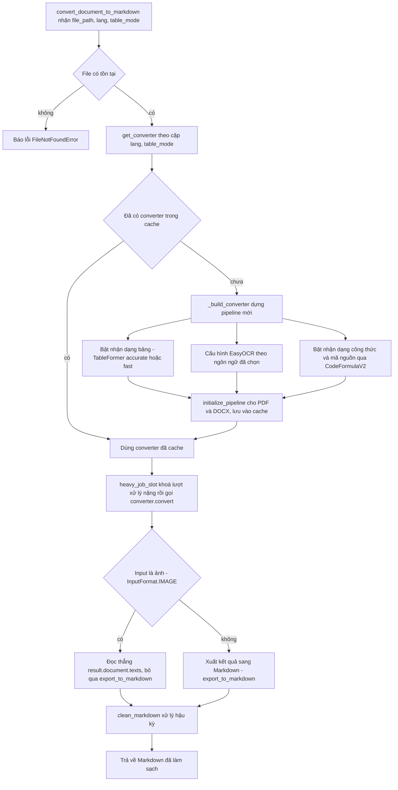

Mỗi tổ hợp (ngôn ngữ OCR, chế độ bảng) cần một `DocumentConverter` riêng vì docling gắn cứng cấu hình này lúc khởi tạo pipeline. Hệ thống **dựng lười (lazy) và cache theo tổ hợp**, chỉ tổ hợp mặc định (`vi_en` + `accurate`) được nạp sẵn ngay lúc khởi động.

Với DOCX, docling đọc trực tiếp cấu trúc XML gốc (OOXML) thay vì OCR — bảng biểu giữ nguyên chính xác từ file Word. Với PDF nhiều trang, `_convert_pdf_in_chunks` chia tài liệu thành từng cụm trang để tránh cấp phát bộ nhớ một lần cho toàn bộ file (xem mục 3.1). Với input dạng ảnh đơn lẻ (một trang hoặc một vùng đã cắt — xem mục 3.4), model layout của docling đôi khi phân loại nhầm toàn bộ ảnh thành cluster "Picture" duy nhất; khi đó `export_to_markdown()` xuất placeholder `<!-- image -->` thay vì nội dung, nên pipeline ảnh đọc thẳng `result.document.texts` thay vì đi qua bước export chuẩn.

Toàn bộ bước gọi `converter.convert` — dù đến từ Mark Tini hay từ Tini OCR/xuất Word — đều đi qua `heavy_job_slot()` (`resource_scheduler.py`), một khóa mutex cấp tiến trình đảm bảo **chỉ một tác vụ ML nặng chạy tại một thời điểm trên toàn bộ Tini Suite**, kể cả khi Mark Tini và Tini OCR đang mở song song và cả hai đều đang có việc để làm.

### 3.3. Hậu xử lý Markdown (làm sạch bảng biểu)

Không đổi so với v1.3.0. Module `markdown_cleaner.py` xử lý hậu kỳ theo nguyên tắc **không bao giờ đánh mất nội dung** — mọi phép biến đổi đều tự kiểm chứng trước khi áp dụng, nếu không chắc chắn thì giữ nguyên bảng gốc.

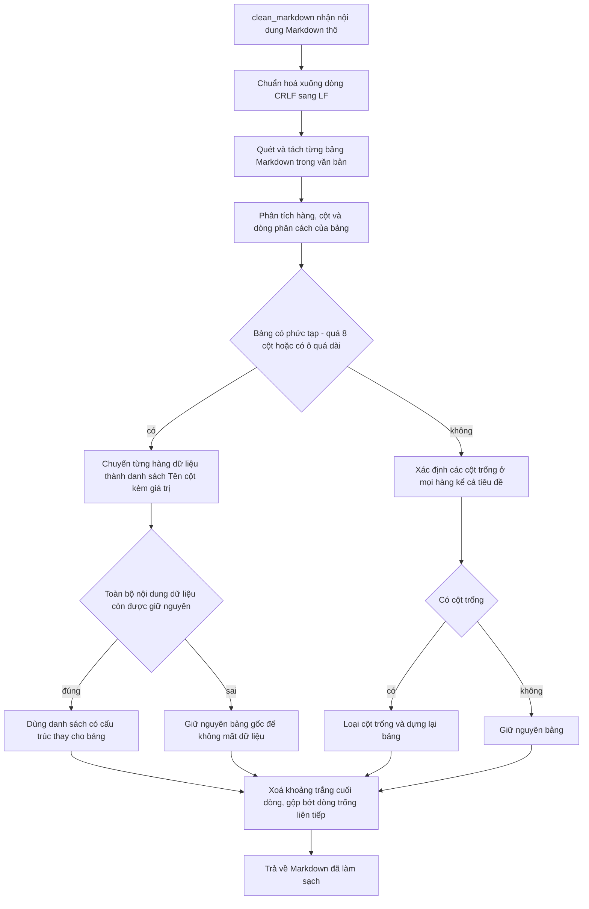

Bước kiểm chứng "Toàn bộ nội dung dữ liệu còn được giữ nguyên" (`_preserves_data_content`) so khớp ngữ nghĩa từng ô dữ liệu gốc với kết quả sau biến đổi trước khi chấp nhận thay bảng — nếu phát hiện có khả năng mất dữ liệu, hệ thống tự động lùi lại giữ bảng thô thay vì mạo hiểm.

### 3.4. Trích xuất vùng PDF theo lựa chọn (Region OCR)

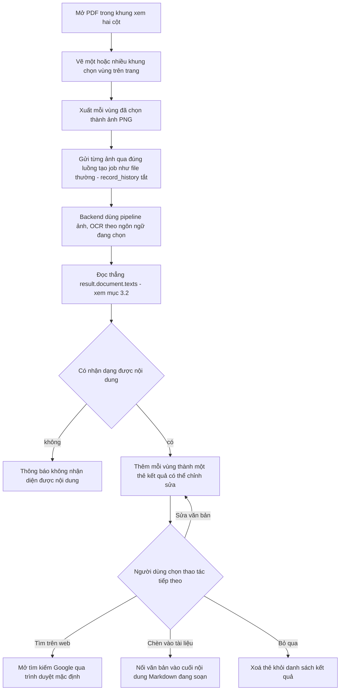

Tính năng này tái sử dụng **cùng một pipeline** `/api/jobs` như chuyển đổi file thường, chỉ khác ở cờ `record_history=false`. Việc mở link tìm kiếm được ủy quyền qua IPC sang tiến trình Electron chính, và chỉ chấp nhận URL `http(s)`. Lỗi cũ khiến vùng cắt nhỏ trả về placeholder `<!-- image -->` thay vì chữ thật (xem mục 3.2) đã được sửa và giữ ổn định qua các bản 1.4.x–1.6.0; bảng kết quả trích xuất hiện kéo giãn chiều cao tự do thay vì cố định.

### 3.5. Xác minh trích dẫn (Citation Verification)

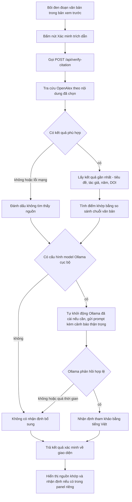

Đây là **tính năng duy nhất trong toàn bộ Tini Suite cần internet**. Cả hai lệnh gọi mạng (OpenAlex, Ollama) đều "best-effort": lỗi mạng, timeout, hay kết quả rỗng đều được nuốt lại và báo "không xác minh được" — không bao giờ trả về lỗi 500 hay quy kết "trích dẫn giả" chỉ vì một lần gọi mạng thất bại. Model Ollama mặc định hiện là **`qwen2.5:3b`** (đổi từ trạng thái "không đặt = tắt" ở v1.3.0 — xem mục 7.2); nếu người dùng đã cài Ollama, Mark Tini tự khởi động tiến trình Ollama khi cần thay vì bắt người dùng mở tay. Nhận định của Ollama luôn mang tính **tham khảo, không phải kết luận cuối cùng**.

### 3.6. Dịch máy có che công thức & thuật ngữ (Translation)

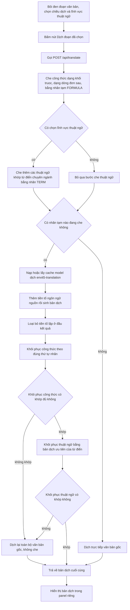

Nguyên lý cốt lõi là **"không bao giờ trả về nội dung bị hỏng"**: nếu số lượng hoặc thứ tự nhãn tạm sau khi dịch không khớp chính xác với những gì đã che, hệ thống **tự động dịch lại từ văn bản gốc không che**. Panel kết quả (`TranslationPanel`) chỉ hiển thị bản dịch kèm badge chiều dịch/lĩnh vực — không lặp lại văn bản gốc đã bôi đen sẵn ở trên. Không có thay đổi hành vi so với v1.3.0.

### 3.7. Tini Core — vòng đời backend dùng chung & tự khởi động lại

Từ v1.6.0, việc "giám sát & tự khởi động lại backend" không còn là chuyện của riêng một cửa sổ Electron nữa — module `TiniCoreSupervisor` (`frontend/electron/coreSupervisor.ts`) điều phối một backend **dùng chung giữa Mark Tini và Tini OCR**, có thể đang chạy 0, 1, hoặc 2 cửa sổ tại một thời điểm.

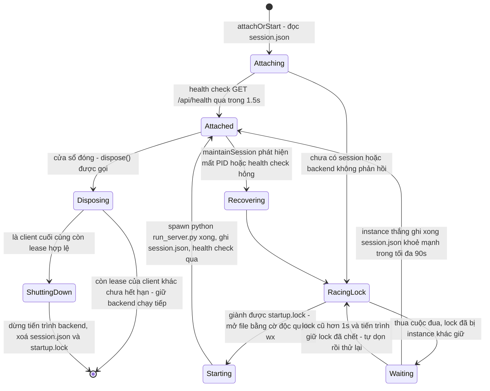

Cơ chế cụ thể (đã xác minh trực tiếp trong mã nguồn):
- **Descriptor dùng chung:** `session.json` lưu `instanceId`, `pid`, `port` (cố định `8088`), và `token` — mọi cửa sổ đọc cùng file này để biết cách kết nối vào backend đang chạy.
- **Đua giành quyền khởi động:** `startup.lock` được mở bằng cờ `wx` (tạo file, lỗi nếu đã tồn tại) — chỉ một tiến trình Electron thắng cuộc đua và được phép `spawn` backend; các tiến trình còn lại chờ tối đa 90 giây (poll mỗi 250ms) rồi đọc `session.json` của bên thắng.
- **Lease theo từng client:** mỗi cửa sổ ghi một file lease riêng trong thư mục `clients/`, cập nhật mỗi 5 giây; lease quá 20 giây không cập nhật hoặc có PID đã chết bị coi là hết hạn và tự dọn.
- **Khôi phục sau crash:** nếu backend chết đột ngột trong lúc vẫn còn cửa sổ đang mở, `maintainSession()` phát hiện qua health check hỏng, giành lại `startup.lock` và khởi động lại — giữ nguyên `token` cũ nếu còn dùng được để các cửa sổ khác không cần refresh phiên.
- **Tắt theo "client cuối cùng":** đóng một cửa sổ không tắt backend ngay — chỉ khi **không còn lease nào đang hoạt động** (tức không còn cửa sổ Mark Tini/Tini OCR nào mở), instance đó mới thực sự dừng tiến trình Python và xoá `session.json`/`startup.lock`.
- **An toàn khi migrate dữ liệu:** lần đầu chạy sau khi nâng cấp, `prepareDirectoriesAndMigration()` tự copy dữ liệu cũ từ thư mục `userData` phiên bản trước sang thư mục dữ liệu dùng chung mới nếu khác đường dẫn, không đè lên file đã tồn tại.

Việc tự khởi động lại khi crash trong một backend đơn lẻ trước đây (v1.3.0, backoff cấp số nhân tối đa 5 lần) nay được thay bằng cơ chế đua-giành-lock ở trên, vốn đã bao hàm cả trường hợp một cửa sổ crash trong khi cửa sổ còn lại vẫn cần backend sống. Khi đóng toàn bộ cửa sổ (client cuối), tiến trình backend vẫn được dừng dứt khoát để không để sót tiến trình chạy ngầm.

### 3.8. Tự động lưu bản nháp (Autosave)

Không đổi so với v1.3.0.

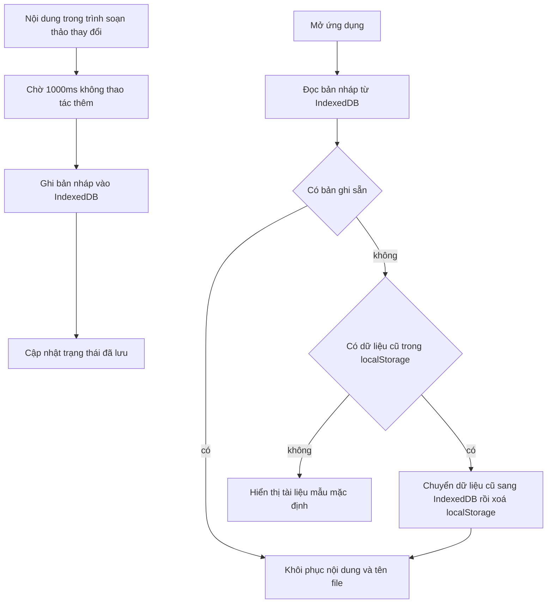

Autosave lưu vào IndexedDB của trình duyệt nội bộ (không qua backend) nên hoạt động ngay cả khi backend chưa sẵn sàng. Debounce 1 giây tránh ghi liên tục khi người dùng đang gõ.

### 3.9. Thu gọn / kéo giãn Sidebar

Không đổi so với v1.3.0, áp dụng cho cả hai sản phẩm (`Sidebar.tsx` của Mark Tini và `OcrSidebar.tsx` của Tini OCR dùng chung cơ chế lưu trạng thái).

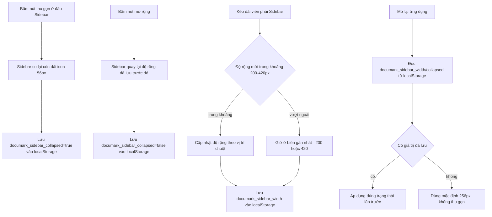

### 3.10. Tini OCR — tiền xử lý ảnh & nhận dạng *(mới)*

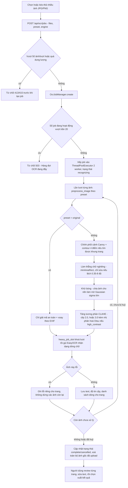

Điểm kỹ thuật đáng chú ý:
- **3 preset tiền xử lý** (`image_preprocessor.py`, đã xác minh trực tiếp trong mã nguồn): `original` (chỉ giải mã an toàn + xoay EXIF, không chỉnh sửa pixel), `balanced` (mặc định — chỉnh phối cảnh, làm thẳng, khử bóng, CLAHE clip 2.0), `high_contrast` (như `balanced` nhưng CLAHE clip 3.0 và nhị phân hoá Otsu, phù hợp ảnh chụp mờ/thiếu sáng).
- **An toàn giải mã ảnh:** giới hạn 12.000px mỗi chiều và 50 triệu pixel, dùng `DecompressionBombWarning` của Pillow để chặn ảnh "bomb giải nén" trước khi xử lý.
- **Trần đồng thời (mới, cùng đợt hardening với báo cáo này):** `OcrJobManager` giới hạn tối đa **20 job đang hoạt động cùng lúc** (`MAX_ACTIVE_OCR_JOBS`); vượt trần bị từ chối ngay ở bước tạo job với `OcrJobCapacityError` → HTTP 503, kèm dọn sạch ảnh vừa upload thay vì xếp hàng vô hạn và có nguy cơ tràn RAM. Cơ chế đối xứng với `JobCapacityError` đã có sẵn ở hàng đợi Mark Tini.
- **Một ảnh lỗi không chặn các ảnh còn lại:** giống nguyên tắc "không giấu kết quả" của Mark Tini — lỗi nhận dạng một trang chỉ gắn vào đúng trang đó.
- **EasyOCR dùng chung:** cùng một instance reader phục vụ cả Region OCR (Mark Tini, mục 3.4) và Tini OCR, tránh nạp trùng model 2 lần khi cả hai sản phẩm cùng mở.
- **Engine mở rộng được:** hiện chỉ có `easyocr` (`SUPPORTED_IMAGE_OCR_ENGINES = {"easyocr"}`) nhưng tham số `engine` đã có sẵn trong API để bổ sung engine khác về sau mà không phải đổi contract.

### 3.11. Xuất Word chỉnh sửa được — nhúng ảnh/sơ đồ thật *(cập nhật)*

Trước bản cập nhật này, Tini Suite có **hai đường xuất DOCX khác triết lý**. Đường "DOCX giống PDF" (render từng trang PDF thành ảnh lossless qua `pdf_to_word_service.py`, không sửa chữ được) đã bị **gỡ bỏ hoàn toàn** — không còn cần thiết sau khi đường chỉnh sửa được nâng cấp để hỗ trợ đầy đủ ảnh/sơ đồ thật. Chỉ còn lại **một đường xuất Word duy nhất**:

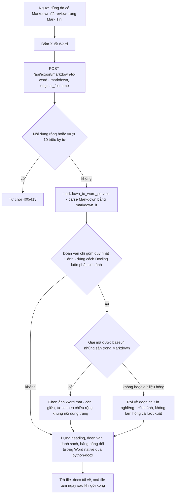

- **Nguồn ảnh:** ảnh/sơ đồ khối không được xử lý lại ở bước xuất Word — Docling giữ lại bitmap của từng picture/diagram ngay tại bước convert PDF gốc (`generate_picture_images`, `images_scale = 2.0` — mục 3.2) và nhúng thẳng dưới dạng `data:image/...;base64,...` khi xuất Markdown (`image_mode=ImageRefMode.EMBEDDED`), thay cho comment placeholder `<!-- image -->` như trước. `markdown_to_word_service.py` chỉ đọc lại đúng dữ liệu đã có sẵn trong chuỗi Markdown, không chạy lại pipeline ML — giữ đúng nguyên tắc "không chạy pass ML thứ hai" đã áp dụng từ đầu.
- **DOCX chỉnh sửa được** (`markdown_to_word_service.py`, `python-docx` + `markdown_it`): dùng chính Markdown mà Docling đã trích xuất và người dùng đã sửa trong editor — không chạy lại pipeline ML, nên nhanh và giữ đúng nội dung đã review. Giới hạn 10.000.000 ký tự (`MAX_EDITABLE_DOCX_CHARACTERS`) để tránh sinh file quá lớn; nhúng ảnh base64 làm tăng dung lượng chuỗi Markdown (~33% dung lượng ảnh gốc) nên tài liệu nhiều ảnh chạm ngưỡng này sớm hơn.
- **Giới hạn có chủ đích:** Markdown thuần không có cú pháp căn lề đoạn văn, nên độ trung thực căn giữa/căn lề của **văn bản** so với tài liệu gốc không thể khôi phục qua trung gian Markdown — chỉ **ảnh/sơ đồ** được đảm bảo căn giữa (quy ước chuẩn cho hình trong Word), không áp dụng cho đoạn văn bản thường (xem thêm mục 11).
- Tini OCR có đường xuất DOCX riêng (`ocr_export_service.py`, xem `/api/ocr/export` ở mục 5.2) — không dùng chung service này vì đầu vào là ảnh + text đã review theo từng trang, không phải Markdown.

### 3.12. Chọn cả thư mục & xử lý theo lô *(mới)*

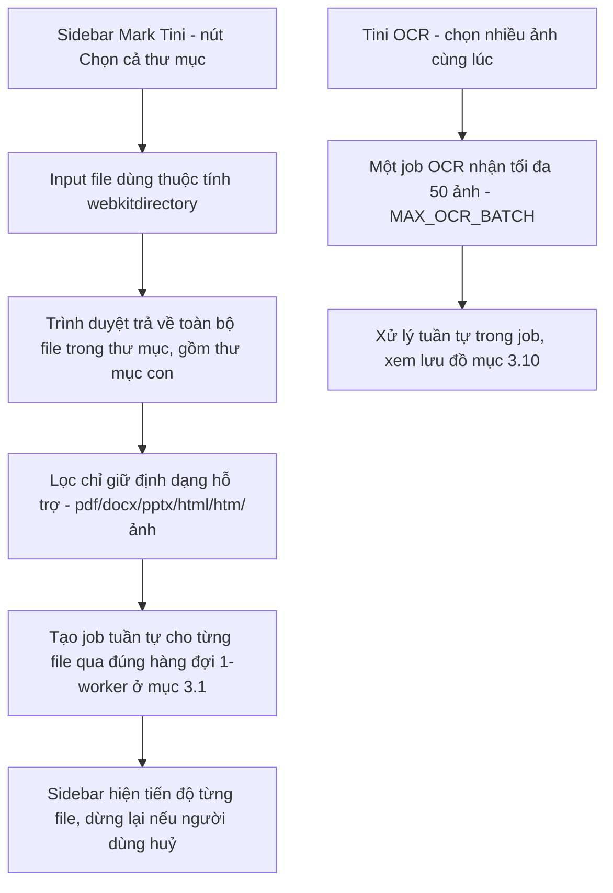

Chọn cả thư mục ở Mark Tini không tạo một "siêu job" duy nhất — mỗi file trong thư mục vẫn đi qua đúng vòng đời `queued → converting → finalizing → complete` của mục 3.1, chỉ khác là Sidebar tự động xếp lần lượt thay vì người dùng chọn từng file. Điều này giữ nguyên toàn bộ tính chất an toàn (hủy giữa chừng, rollback lỗi, không tràn RAM) mà không cần thêm trạng thái job mới. Tini OCR không có nút chọn thư mục riêng — thay vào đó cho chọn nhiều ảnh cùng lúc trong một job (giới hạn 50 ảnh/lượt), xử lý tuần tự bên trong worker của job đó.

---

## 4. Tính năng sản phẩm

### 4.1. Chuyển đổi tài liệu (lõi Mark Tini)

- Định dạng đầu vào: `.pdf`, `.docx`, `.pptx`, `.html`/`.htm`, ảnh thông dụng (PNG/JPG/TIFF/BMP...).
- OCR: chọn `vi+en` (mặc định), chỉ `vi`, hoặc chỉ `en`.
- Nhận dạng bảng biểu bằng AI (TableFormer): chế độ `accurate` hoặc `fast`.
- Nhận dạng công thức toán/lý/hóa → LaTeX, và khối mã nguồn — dùng model `CodeFormulaV2`.
- Hàng đợi xử lý thật: `queued → converting → finalizing → complete`, có thể hủy job đang chạy an toàn (mục 3.1).
- Tải lên nhiều file hoặc **cả một thư mục** cùng lúc, xử lý tuần tự từng file (mục 3.12).
- PDF nhiều trang được chia cụm, tự cứu trang lỗi, chỉ báo hoàn tất sau khi đã kiểm tra đủ số trang (mục 3.1).
- Giới hạn upload 100 MiB/file, kiểm tra cả nội dung thực của file (không chỉ tin phần mở rộng).

### 4.2. Trích xuất vùng PDF (OCR theo lựa chọn)

Chọn một vùng bất kỳ trên trang PDF để OCR riêng vùng đó. Kết quả hiện ở panel riêng có thể sửa văn bản, tìm kiếm trên web, hoặc chèn thẳng vào tài liệu Markdown đang soạn (mục 3.4); bảng kết quả kéo giãn chiều cao tự do.

### 4.3. Xuất Word chỉnh sửa được *(cập nhật)*

- Xuất trực tiếp từ Markdown đã review trong Mark Tini thành heading/đoạn/danh sách/bảng Word thật, sửa chữ được ngay trong Word.
- Ảnh/sơ đồ khối trong tài liệu gốc được tách và nhúng lại thành ảnh Word thật — căn giữa, tự co theo chiều rộng trang — thay vì hiện dưới dạng placeholder văn bản.
- Hộp thoại Lưu thành cho phép chọn thẳng thư mục đích (kể cả USB) thay vì luôn tải vào thư mục Downloads mặc định.
- Chi tiết thuật toán và giới hạn: mục 3.11.

### 4.4. Tini OCR — ứng dụng OCR ảnh độc lập *(mới)*

- Cửa sổ riêng biệt trong cùng bộ cài, dùng chung backend/model với Mark Tini (mục 2.1, 3.7).
- Nhận nhiều ảnh JPG/PNG cùng lúc (tối đa 50 ảnh/lượt), 3 preset tiền xử lý ảnh chụp (`original`/`balanced`/`high_contrast` — mục 3.10) để xử lý ảnh chụp bằng điện thoại bị nghiêng, cong, hoặc thiếu sáng.
- Review kết quả theo từng trang: sửa text trực tiếp, xem lại từng ảnh gốc.
- Xuất 4 định dạng: TXT, Markdown, DOCX chỉnh sửa được, DOCX giống ảnh gốc (mục 3.11, `ocr_export_service.py`).
- Hàng đợi có trần 20 job hoạt động đồng thời, trả lỗi 503 rõ ràng khi đầy thay vì xếp hàng vô hạn (mục 3.10).

### 4.5. Xác minh trích dẫn *(cần internet)*

Bôi đen một đoạn trích dẫn/tuyên bố trong bản xem trước, bấm **"Xác minh trích dẫn"**:
- Tra cứu nguồn khớp gần nhất qua OpenAlex — trả về tiêu đề, tác giả, năm, DOI, điểm khớp.
- Nếu có Ollama cài sẵn, có thêm nhận định tham khảo bằng model mặc định **`qwen2.5:3b`** (đổi qua biến `DOCUMARK_OLLAMA_MODEL` nếu muốn) — Mark Tini tự khởi động Ollama khi cần, không bắt người dùng mở tay.
- Tính năng **duy nhất** trong Tini Suite cần kết nối mạng.

### 4.6. Dịch hai chiều Anh ↔ Việt *(offline hoàn toàn)*

Không đổi so với v1.3.0: 3 bộ từ điển thuật ngữ chuyên ngành (AI/ML, Toán-Lý-Hóa, Kinh tế/Xã hội — 102 thuật ngữ), công thức được che tạm và khôi phục an toàn (mục 3.6), panel kết quả gọn chỉ hiện bản dịch.

### 4.7. Lịch sử & lưu trữ

Danh sách các lần chuyển đổi trước, mở lại output cũ, xóa mục không cần. Từ v1.4.x, lịch sử còn giữ lại **file gốc đã upload** (`data/originals/`) để khôi phục/tải lại đúng file PDF/DOCX ban đầu từ một mục lịch sử (`GET /api/history/{job_id}/original`), không chỉ giữ mỗi Markdown kết quả như trước. Dữ liệu lưu tại `%APPDATA%\Tini Suite\data` — dùng chung cho cả Mark Tini và Tini OCR (mục 3.7), tách biệt hoàn toàn khỏi thư mục cài đặt.

### 4.8. Soạn thảo & thao tác tài liệu

- Trình soạn thảo Markdown với 3 chế độ xem: chỉ soạn thảo, soạn thảo + xem trước song song, chỉ xem trước.
- Tự động lưu bản nháp mỗi khi có thay đổi (debounce 1 giây, IndexedDB — mục 3.8).
- Mở file Markdown có sẵn để chỉnh sửa tiếp; tạo tài liệu mới.
- Lưu kết quả ra `.md`, hoặc xuất Word theo một trong hai chế độ ở mục 4.3; sao chép toàn bộ nội dung vào clipboard.
- Sidebar bên trái thu gọn được (dải icon 56px) hoặc kéo giãn tự do 200–420px, trạng thái nhớ qua các lần mở app (mục 3.9).

### 4.9. Chọn cả thư mục *(mới)*

Ở Mark Tini, nút "Chọn cả thư mục" nạp toàn bộ file hỗ trợ trong một thư mục (kể cả thư mục con) và xếp lần lượt vào đúng hàng đợi 1-worker hiện có — không phải một luồng xử lý riêng, nên giữ nguyên toàn bộ đảm bảo về hủy job an toàn và rollback lỗi (mục 3.12).

### 4.10. Tini Core — nền tảng dùng chung *(mới)*

Không phải một tính năng người dùng thấy trực tiếp, nhưng là hạ tầng cho phép mở đồng thời Mark Tini và Tini OCR mà không tốn gấp đôi RAM/thời gian nạp model: một backend, một bộ model, hai giao diện (mục 2.1, 3.7).

---

## 5. Các dịch vụ backend & danh sách API

### 5.1. Thành phần backend đi kèm hệ thống

| Thành phần | Vai trò | Đóng gói cùng app? |
|---|---|---|
| Python runtime (chuẩn, độc lập) | Chạy toàn bộ backend, không cần cài Python hệ thống | Có |
| FastAPI + Uvicorn | Máy chủ API nội bộ dùng chung, lắng nghe `127.0.0.1:8088` | Có |
| Docling (`docling_service.py`) | Engine phân tích layout, bảng biểu, OCR, công thức/mã nguồn | Có |
| EasyOCR | OCR nhận dạng chữ — dùng chung cho Region OCR và Tini OCR | Có (gói ngôn ngữ vi+en) |
| Model dịch máy (`VietAI/envit5-translation`) | Dịch máy Anh↔Việt cục bộ | Có |
| `image_preprocessor.py` | Tiền xử lý ảnh chụp cho Tini OCR — phối cảnh, deskew, khử bóng, CLAHE | Có |
| `image_ocr_service.py` | Gọi EasyOCR nhận dạng ảnh đã tiền xử lý, ghép kết quả theo trang | Có |
| `ocr_job_service.py` | Hàng đợi Tini OCR (ThreadPoolExecutor, trần 20 job hoạt động) | Có (mã nguồn nội bộ) |
| `ocr_export_service.py` | Xuất kết quả Tini OCR: TXT/Markdown/DOCX chỉnh sửa/DOCX giống ảnh | Có |
| `markdown_to_word_service.py` | Xuất Markdown đã review thành DOCX chỉnh sửa được, gồm nhúng ảnh/sơ đồ thật | Có |
| `resource_scheduler.py` | `heavy_job_slot()` — ép mọi tác vụ ML nặng về concurrency 1 toàn tiến trình | Có |
| Hàng đợi Mark Tini (`job_service.py`, `ConversionJobManager`) | Điều phối job chuyển đổi tuần tự, trong tiến trình | Có |
| `history_service.py` | Lưu/đọc lịch sử dạng file JSON, ghi nguyên tử, khóa luồng | Có |
| `logging_utils` | Log xoay vòng theo dung lượng + mã tương quan theo request | Có |
| Tini Core Supervisor (`coreSupervisor.ts`, phía Electron) | Điều phối 1 backend dùng chung giữa 2 cửa sổ, khởi động lại khi crash | Có |
| OpenAlex API | Tra cứu học thuật cho xác minh trích dẫn | **Không** — dịch vụ ngoài, cần internet |
| Ollama (tùy chọn) | Model ngôn ngữ cục bộ cho nhận định trích dẫn tham khảo | **Không** — người dùng tự cài, mặc định gợi ý model `qwen2.5:3b` |

Toàn bộ backend vẫn chạy trong **một tiến trình Python duy nhất**, không có microservice, không có database server — trạng thái giữ trong bộ nhớ tiến trình (job đang chạy) và file JSON trên đĩa (lịch sử).

### 5.2. Danh sách API endpoint

Tiền tố chung: `http://127.0.0.1:8088`. Trừ `GET /` và `GET /api/session`, mọi endpoint dưới `/api/*` đều yêu cầu header `X-DocuMark-Token` hợp lệ (đã xác minh trực tiếp từng decorator route trong `main.py` — tổng cộng **21 route**, tăng từ 12 route ở v1.3.0; giảm từ 22 sau khi gỡ route `/api/export/pdf-to-word-faithful`).

| Phương thức | Đường dẫn | Xác thực | Chức năng |
|---|---|---|---|
| GET | `/` | Không | Phục vụ frontend đã build (chế độ đóng gói) |
| GET | `/api/session` | Kiểm tra Origin | Cấp token phiên cho renderer chạy ở chế độ trình duyệt/dev |
| GET | `/api/health` | Có | Trạng thái khởi động backend: `starting`/`loading_models`/`ready`/`error` |
| POST | `/api/jobs` | Có | Tạo job chuyển đổi Mark Tini mới → 202 + trạng thái job |
| GET | `/api/jobs/{job_id}` | Có | Lấy trạng thái job hiện tại (polling tiến độ) |
| GET | `/api/jobs/{job_id}/result` | Có | Lấy Markdown kết quả khi job đã `complete` (409 nếu chưa sẵn sàng) |
| DELETE | `/api/jobs/{job_id}` | Có | Yêu cầu hủy job |
| POST | `/api/convert` | Có | Endpoint tương thích cũ — chờ tới khi job xong rồi trả kết quả trực tiếp |
| GET | `/api/download/{job_id}` | Có | Tải file `.md` kết quả, đặt lại tên theo tên file gốc |
| POST | `/api/export/markdown-to-word` | Có | Xuất Markdown đã review thành DOCX chỉnh sửa được, gồm nhúng ảnh/sơ đồ thật |
| POST | `/api/ocr/jobs` | Có | *(mới)* Tạo job Tini OCR — tối đa 50 ảnh/lượt, preset + engine, 503 nếu đầy trần |
| GET | `/api/ocr/jobs/{job_id}` | Có | *(mới)* Trạng thái job Tini OCR |
| GET | `/api/ocr/jobs/{job_id}/result` | Có | *(mới)* Kết quả OCR theo từng trang khi job `complete` |
| DELETE | `/api/ocr/jobs/{job_id}` | Có | *(mới)* Hủy job Tini OCR |
| POST | `/api/ocr/export` | Có | *(mới)* Xuất kết quả OCR đã review sang TXT/Markdown/DOCX (2 chế độ) |
| GET | `/api/history` | Có | Danh sách lịch sử chuyển đổi |
| GET | `/api/history/{job_id}` | Có | Chi tiết 1 mục lịch sử kèm nội dung Markdown đầy đủ |
| GET | `/api/history/{job_id}/original` | Có | *(mới)* Tải lại đúng file gốc đã upload cho mục lịch sử này |
| DELETE | `/api/history/{job_id}` | Có | Xóa mục lịch sử và file output liên quan |
| POST | `/api/verify-citation` | Có | Xác minh trích dẫn qua OpenAlex + Ollama tùy chọn — **cần internet** |
| POST | `/api/translate` | Có | Dịch đoạn văn bản đã chọn — offline hoàn toàn |

### 5.3. Bảo mật & xác thực

- **Token phiên theo vòng đời Tini Core:** token 32 byte (base64url) được sinh khi backend khởi động lần đầu và giữ nguyên cho tới khi client cuối cùng đóng (mục 3.7) — không phải sinh lại mỗi lần mở một cửa sổ mới, vì cửa sổ mới có thể chỉ đang gắn vào backend đã chạy sẵn. So khớp token dùng `secrets.compare_digest`.
- **Chỉ lắng nghe localhost:** backend bind `127.0.0.1`, không phải `0.0.0.0`.
- **Allowlist Origin cho bootstrap token:** `/api/session` chỉ phục vụ Origin trong danh sách tin cậy (`DOCUMARK_TRUSTED_ORIGINS`).
- **Kiểm tra nội dung file thực tế:** mọi file tải lên (tài liệu lẫn ảnh Tini OCR) được kiểm tra magic bytes hoặc cấu trúc zip OOXML trước khi vào pipeline — sai định dạng bị từ chối 415.
- **Giới hạn theo lượt cho Tini OCR/xuất Word:** tối đa 50 ảnh/lượt OCR (`MAX_OCR_BATCH`), 10.000.000 ký tự/lượt xuất DOCX chỉnh sửa được (`MAX_EDITABLE_DOCX_CHARACTERS`), giới hạn kích thước/số chiều pixel khi giải mã ảnh (`image_preprocessor.py`) để chặn ảnh "bomb giải nén".
- **Trần đồng thời chặn nghẽn tài nguyên:** hàng đợi Tini OCR từ chối job mới với HTTP 503 khi có từ 20 job hoạt động trở lên, thay vì xếp hàng không giới hạn.
- **An toàn tên file:** tên file gốc được chuẩn hóa, file lưu trên đĩa dùng UUID làm tên để tránh path traversal.
- **Renderer không có quyền hệ thống trực tiếp:** `contextIsolation: true`, `nodeIntegration: false`, `sandbox: true` cho cả hai cửa sổ Mark Tini và Tini OCR.

### 5.4. Ghi log & truy vết (observability)

- Mỗi request HTTP được gán mã tương quan (12 ký tự hex) qua header `X-Request-ID`, gắn vào mọi dòng log liên quan.
- Log ghi song song ra console và file `backend.log` xoay vòng (tối đa 5 MB/file, giữ 5 file cũ) tại `%APPDATA%\Tini Suite\data\logs` — dùng chung cho cả hai sản phẩm vì cùng một tiến trình backend.
- Middleware ghi log tóm tắt mỗi request: phương thức, đường dẫn, mã trạng thái, thời gian xử lý.

---

## 6. Model AI đang sử dụng

Tất cả chạy **cục bộ, trên CPU** (không cần GPU/CUDA). Không có model AI mới nào được thêm từ v1.3.0 — Tini OCR và xuất Word đều tái sử dụng model đã có sẵn (EasyOCR, Docling) thay vì nạp thêm.

| Model | Vai trò | Nguồn |
|---|---|---|
| `docling-project/docling-layout-heron` | Phân tích bố cục trang | Docling project (HuggingFace) |
| `docling-project/docling-models` (TableFormer v2.3.0) | Nhận dạng cấu trúc bảng biểu | Docling project |
| `docling-project/CodeFormulaV2` | Nhận dạng công thức toán/lý/hóa và khối mã nguồn | Docling project |
| EasyOCR (gói `vi`+`en`) | OCR nhận dạng chữ — dùng chung cho Region OCR (Mark Tini) và Tini OCR | EasyOCR 1.7.2 |
| `VietAI/envit5-translation` | Dịch máy Anh↔Việt (T5, checkpoint song hướng) | VietAI (HuggingFace) |

Tổng dung lượng bundle model không đổi so với v1.3.0 (**~2.3 GB**) vì không có model mới — Tini OCR chỉ thêm code xử lý ảnh (OpenCV/Pillow) và hàng đợi, không thêm trọng số model.

---

## 7. Thông số kỹ thuật & cấu hình

### 7.1. Yêu cầu cấu hình máy

Số liệu RAM dưới đây là số liệu **đo thực tế** cho pipeline Mark Tini gốc (v1.3.0), theo dõi RSS tiến trình backend qua từng bước khởi động thật; báo cáo này chưa có phiên đo lại riêng cho Tini OCR/xuất Word, nhưng vì cả hai đều dùng chung model đã nạp sẵn (không nạp thêm) và bị ép về concurrency 1 qua `heavy_job_slot`, mức RAM đỉnh dự kiến nằm trong cùng khoảng đã đo dưới đây, không cộng dồn thêm một bộ model thứ hai:

| Giai đoạn | RAM tiến trình backend |
|---|---|
| Vừa khởi động Python, chưa nạp gì | ~26 MB |
| Sau khi nạp thư viện lõi (FastAPI, Docling, EasyOCR) | ~335 MB |
| Sau khi nạp đủ model mặc định (layout + bảng + công thức/mã + OCR) — tự động mỗi lần mở app | ~1.43 GB |
| Sau khi dùng thêm tính năng dịch ít nhất 1 lần (model dịch nạp lười) | ~2.48 GB |

Cộng thêm phần Electron/Chromium hiển thị giao diện (thường 200–500 MB **cho mỗi cửa sổ** — mở cả Mark Tini lẫn Tini OCR cùng lúc nhân đôi phần này dù backend dùng chung) và bản thân Windows, khuyến nghị:

- **RAM: tối thiểu 8 GB, khuyến nghị 16 GB.**
- **CPU: bất kỳ CPU x64 hiện đại nào** — không cần GPU rời/CUDA. Số luồng Docling dùng cho suy luận (`ACCELERATOR_NUM_THREADS`) được tính tự động bằng `max(4, min(số_lõi_CPU - 2, 16))`, chừa lại lõi cho hệ điều hành và UI thay vì chiếm toàn bộ CPU.
- **Ổ đĩa:** cùng một bộ cài phục vụ cả hai sản phẩm nên dung lượng không nhân đôi; xem số đo thực tế bản build gần nhất ở mục 9. Nên còn trống tối thiểu **6 GB**.
- **Hệ điều hành:** Windows 10/11 64-bit.
- **Mạng:** không bắt buộc để cài đặt hoặc dùng tính năng chính. Chỉ cần mạng khi dùng "Xác minh trích dẫn".
- **Quyền cài đặt:** không cần quyền quản trị (admin).

### 7.2. Cấu hình qua biến môi trường

Backend đọc cấu hình từ biến môi trường (module `config.py`), có giá trị mặc định an toàn nếu không đặt. Trong bản đóng gói, Tini Core tự đặt các biến quan trọng — người dùng cuối không cần chỉnh gì. So với bảng cấu hình ở báo cáo v1.3.0, **chỉ một giá trị mặc định thay đổi** (đã xác minh qua diff trực tiếp `config.py`): model Ollama mặc định. Các tham số mới của Tini OCR/xuất Word (trần job, giới hạn ảnh/ký tự...) là **hằng số cố định trong code**, không phải biến môi trường — xem cột "Loại" bên dưới.

| Biến môi trường / hằng số | Giá trị mặc định | Ý nghĩa | Loại |
|---|---|---|---|
| `DOCUMARK_DATA_DIR` | `<project>/data` (Electron đặt `%APPDATA%\Tini Suite\data`) | Thư mục chứa upload tạm, output, lịch sử, log — dùng chung 2 sản phẩm | Biến môi trường |
| `DOCUMARK_API_TOKEN` | sinh ngẫu nhiên nếu không đặt | Token xác thực API | Biến môi trường |
| `DOCUMARK_TRUSTED_ORIGINS` | `127.0.0.1:8088`, `localhost:8088`, `127.0.0.1:5173`, `localhost:5173` | Origin được phép lấy token qua `/api/session` | Biến môi trường |
| `DOCUMARK_CORS_ORIGINS` | = trusted origins + `null` | Origin được phép gọi CORS | Biến môi trường |
| `DOCUMARK_MAX_UPLOAD_MIB` | 100 | Giới hạn dung lượng 1 file tải lên (MiB) | Biến môi trường |
| `DOCUMARK_MAX_HISTORY` | 200 | Số mục lịch sử tối đa giữ trên đĩa | Biến môi trường |
| `DOCUMARK_MAX_JOB_RECORDS` | 250 | Số bản ghi job Mark Tini tối đa giữ trong bộ nhớ | Biến môi trường |
| `DOCUMARK_LOG_LEVEL` | `INFO` | Mức log | Biến môi trường |
| `DOCUMARK_OFFLINE_MODE` | tắt (Electron bật `1` khi đóng gói) | Bắt buộc chạy hoàn toàn offline | Biến môi trường |
| `DOCLING_ARTIFACTS_PATH` | không đặt (Electron trỏ `offline_models`) | Đường dẫn model AI đã đóng gói sẵn | Biến môi trường |
| `DOCUMARK_TRANSLATION_MODEL_PATH` | không đặt (Electron trỏ `offline_models/translation`) | Đường dẫn model dịch cục bộ | Biến môi trường |
| `DOCUMARK_TRANSLATION_MODEL` | `VietAI/envit5-translation` | ID model dịch dùng khi không có bản cục bộ | Biến môi trường |
| `DOCUMARK_OLLAMA_URL` | `http://127.0.0.1:11434` | Địa chỉ Ollama cục bộ | Biến môi trường |
| `DOCUMARK_OLLAMA_MODEL` | **`qwen2.5:3b`** *(đổi từ "không đặt" ở v1.3.0)* | Model Ollama dùng cho nhận định tham khảo — nay bật sẵn theo mặc định | Biến môi trường |
| `MAX_ACTIVE_OCR_JOBS` | 20 | Trần số job Tini OCR hoạt động đồng thời, vượt trần → 503 | Hằng số (`main.py`) |
| `MAX_OCR_BATCH` | 50 | Số ảnh tối đa mỗi lượt tạo job OCR hoặc export OCR | Hằng số (`main.py`) |
| `MAX_EDITABLE_DOCX_CHARACTERS` | 10.000.000 | Giới hạn ký tự Markdown mỗi lượt xuất DOCX chỉnh sửa được | Hằng số (`main.py`) |
| `OCR_EXTENSIONS` | `.png`, `.jpg`, `.jpeg` | Định dạng ảnh Tini OCR chấp nhận | Hằng số (`main.py`) |

Backend cố định lắng nghe tại **`127.0.0.1:8088`** (`CORE_PORT` phía Electron cũng cố định `8088`, không cấu hình qua biến môi trường).

---

## 8. Tính ứng dụng

- **Đối tượng chính:** người đọc/nghiên cứu tài liệu khoa học tiếng Anh cần bản Markdown/Word chỉnh sửa được thay vì OCR thô làm hỏng cấu trúc; và người cần số hoá nhanh ảnh chụp giấy tờ/tài liệu (Tini OCR) mà không có máy scan.
- **Offline-first:** phù hợp môi trường không có/hạn chế internet, hoặc dữ liệu nhạy cảm không muốn rời khỏi máy — chỉ 1 tính năng phụ (xác minh trích dẫn) cần mạng.
- **Máy đơn, một người dùng:** ứng dụng desktop cài trên từng máy, không phải server nhiều người dùng. Xử lý tuần tự và trần đồng thời (`heavy_job_slot`, trần job Tini OCR) là lựa chọn thiết kế để an toàn RAM/CPU trên máy cá nhân, áp dụng nhất quán cho cả hai sản phẩm dùng chung backend.
- **Hai nhu cầu, một bộ cài:** thay vì buộc người dùng cài hai ứng dụng riêng (dễ lệch phiên bản, tốn gấp đôi dung lượng model), Tini Suite gộp Mark Tini và Tini OCR vào một gói, chia sẻ runtime/model qua Tini Core.
- **Ngôn ngữ Việt được ưu tiên:** OCR vi+en, dịch hai chiều Anh↔Việt với thuật ngữ chuyên ngành, toàn bộ UI tiếng Việt.
- **Phù hợp quy trình nghiên cứu:** trích xuất nhanh nội dung từ hình/bảng trong PDF, xác minh độ tin cậy trích dẫn, dịch nhanh đoạn khó hiểu, và giờ có thêm đường xuất Word trực tiếp để nộp bài/chia sẻ.

---

## 9. Hướng dẫn cài đặt và chạy test trên máy khách hàng

### Bước 1 — Nhận file và kiểm tra toàn vẹn

File cài đặt: **`Tini Suite Setup 1.6.0.exe`**

Sau khi copy sang máy khách hàng (USB, mạng nội bộ...), mở PowerShell hoặc cmd tại thư mục chứa file, chạy:

```powershell
certutil -hashfile "Tini Suite Setup 1.6.0.exe" SHA256
```

Kết quả phải khớp chính xác với hash của bản build đang phát hành (mỗi lần build lại sẽ cho ra hash khác — kiểm tra với hash đi kèm bản cụ thể được bàn giao):

```
__SHA256_PLACEHOLDER__
```

(Không khớp = file bị hỏng/thiếu khi copy — copy lại, đừng cài.)

### Bước 2 — Cài đặt

- Double-click file `.exe`, không cần quyền admin.
- Không cần mạng trong lúc cài — mọi thứ (runtime, model AI) đã đóng gói sẵn trong file.
- Cài xong, **hai shortcut riêng** — Mark Tini và Tini OCR — xuất hiện trên Desktop/Start Menu, dùng chung một mục gỡ cài đặt.

### Bước 3 — Mở lần đầu

- Nên tắt Wi-Fi/rút mạng trước khi mở, để kiểm tra đúng nghĩa "chạy offline thật".
- Mở **Mark Tini** trước — app hiện lên trong vài giây, không được có lỗi kiểu "Python executable not found" hoặc "Offline models not found".
- Sau đó mở thêm **Tini OCR** trong khi Mark Tini vẫn đang chạy — cửa sổ Tini OCR phải hiện lên nhanh (gắn vào backend đã chạy, không nạp lại model từ đầu). Đóng một trong hai cửa sổ, xác nhận cửa sổ còn lại vẫn hoạt động bình thường (kiểm tra cơ chế "client cuối cùng" ở mục 3.7).

### Bước 4 — Test chuyển đổi & xuất Word với tài liệu thật

Dùng 1 file PDF và 1 file DOCX thật của khách hàng (ưu tiên loại có bảng, công thức, nhiều trang):

- Convert PDF/DOCX, xác nhận Markdown giữ đúng bảng, chữ đậm, công thức.
- Thử **"Chọn cả thư mục"** với một thư mục chứa vài file hỗn hợp định dạng.
- Thử hủy 1 job đang chạy — job dừng ngay trong UI.
- Thử xuất Word với tài liệu có ảnh/sơ đồ khối, mở file `.docx` kết quả bằng Word/LibreOffice kiểm tra ảnh hiện thật (không phải placeholder), căn giữa và không tràn trang.
- Ghi lại thời gian xử lý thực tế trên phần cứng khách hàng.

### Bước 5 — Test Tini OCR (vẫn đang tắt mạng)

Mở Tini OCR, chọn vài ảnh chụp tài liệu thật (thử cả 3 preset), xác nhận nhận dạng chữ đúng, review/sửa text, rồi xuất thử cả 4 định dạng (TXT/Markdown/2 chế độ DOCX).

### Bước 6 — Test dịch (vẫn đang tắt mạng)

Bôi đen 1 đoạn có công thức trong bản xem trước, thử cả 2 chiều dịch và ít nhất 1 lĩnh vực thuật ngữ — phải dịch thành công dù không có mạng, công thức giữ nguyên.

### Bước 7 — Test xác minh trích dẫn (bật lại mạng)

Bôi đen 1 đoạn có trích dẫn thật, bấm "Xác minh trích dẫn" — xác nhận có kết quả khi có mạng.

### Bước 8 — Vị trí lưu dữ liệu

Sau khi convert/OCR, kiểm tra `%APPDATA%\Tini Suite\data` có chứa output — không nằm trong thư mục cài đặt (`Program Files`).

### Nếu có lỗi

Chụp lại dialog lỗi, mở app từ terminal để xem log chi tiết hơn nếu có thể, ghi lại: bước nào fail, thông báo lỗi, phiên bản Windows của máy test. Có thể tra theo mã `X-Request-ID` trong `%APPDATA%\Tini Suite\data\logs\backend.log`.

*(Checklist đầy đủ hơn, dùng cho QA nội bộ, nằm tại [`.viepilot/phases/phase-8-reliability-security-offline/CLEAN-MACHINE-VERIFICATION.md`](../.viepilot/phases/phase-8-reliability-security-offline/CLEAN-MACHINE-VERIFICATION.md) — checklist này chưa được cập nhật cho Tini OCR/Tini Core, xem mục 11.)*

---

## 10. Hướng dẫn sử dụng nhanh

Hướng dẫn sử dụng đầy đủ dành cho người dùng cuối được lưu riêng tại [`huong-dan-su-dung-v1.6.0.md`](huong-dan-su-dung-v1.6.0.md). Tóm tắt nhanh các thao tác chính:

1. **Chuyển đổi tài liệu (Mark Tini):** Sidebar → *Thêm file* hoặc *Chọn cả thư mục* → chọn file/thư mục → chờ xử lý → nội dung Markdown hiện trong khung soạn thảo.
2. **Chọn ngôn ngữ OCR / chế độ bảng:** 2 ô chọn ngay dưới nút tải file trong Sidebar.
3. **Xuất Word:** nút *Xuất Word* trên thanh công cụ — dựng heading/đoạn/bảng Word thật, ảnh/sơ đồ khối được nhúng thật kèm theo.
4. **Trích xuất vùng PDF:** khi mở file PDF, vẽ khung chọn vùng cần OCR riêng trên khung xem PDF bên trái.
5. **Xác minh trích dẫn:** bôi đen đoạn văn bản → nút *Xác minh trích dẫn* (cần mạng).
6. **Dịch đoạn văn bản:** bôi đen đoạn → chọn chiều dịch/lĩnh vực thuật ngữ → nút *Dịch đoạn đã chọn* (không cần mạng).
7. **Tini OCR:** mở ứng dụng Tini OCR riêng → chọn nhiều ảnh → chọn preset xử lý → chờ nhận dạng → review từng trang → xuất TXT/Markdown/DOCX.
8. **Lịch sử:** danh sách các lần chuyển đổi trước ở cuối Sidebar, có thể tải lại cả file gốc đã upload.
9. **Thu gọn/mở rộng Sidebar:** nút mũi tên ở đầu Sidebar, hoặc kéo dải viền phải để chỉnh độ rộng tự do.

---

## 11. Trạng thái hiện tại & giới hạn đã biết

**Đã hoàn thành (verify được qua mã nguồn/test hiện tại):**
- **113/113 unit test backend pass** (đã chạy lại trong phiên làm việc dẫn tới báo cáo này, 14 file test), gồm test mới cho `ocr_job_service` (8 test, thêm trần đồng thời `OcrJobCapacityError`/HTTP 503 và cơ chế trim bản ghi cũ) và test mới cho `markdown_to_word_service`/`docling_service` xác nhận ảnh/sơ đồ được nhúng thật bằng một lượt convert Docling thật không mock (không chỉ test giả lập call shape), cùng test có sẵn cho `ocr_export_service`, `resource_scheduler`, `image_ocr_service`. File `pdf_to_word_service.py` và test riêng của nó đã bị xoá cùng đợt gỡ DOCX "giống PDF" (mục 3.11).
- 11 kịch bản E2E (Playwright, 2 file spec — giảm từ 12 sau khi bỏ kịch bản xuất DOCX giống PDF) — chưa chạy lại trong phiên làm việc dẫn tới báo cáo này; xem CHANGELOG.md để biết lần chạy gần nhất.
- Rebrand Tini Suite hoàn tất: một bộ cài NSIS tạo hai shortcut Mark Tini/Tini OCR, dùng chung Tini Core (mục 3.7) — đã verify cơ chế attach/khởi động lại qua đọc trực tiếp `coreSupervisor.ts`.
- Tini OCR: pipeline tiền xử lý 3 preset + EasyOCR dùng chung, hàng đợi có trần đồng thời, 4 định dạng xuất — đã verify qua mã nguồn và test.
- Xuất Word chỉnh sửa được, gồm nhúng ảnh/sơ đồ khối thật (căn giữa, tự co theo trang) — đã verify qua mã nguồn, test service và một lượt convert Docling thật (mục 3.11).
- Đã sửa lỗi PDF 128+ trang bị lưu thiếu do `std::bad_alloc` (chia cụm trang, tự cứu trang lỗi).
- Lịch sử giữ được file gốc đã upload, có thể tải lại qua `/api/history/{job_id}/original`.
- Các hạng mục kế thừa từ v1.3.0 (hàng đợi Mark Tini, Docling pipeline, markdown cleaner, Region OCR, dịch, xác minh trích dẫn, autosave, sidebar) không có thay đổi hành vi, vẫn đúng như đã verify trước đây.

**Còn lại — cần khách hàng/người test xác nhận:**
- Chưa có ai chạy cài đặt v1.6.0 này trên một máy Windows hoàn toàn sạch — đây chính là mục đích của hướng dẫn ở mục 9. Đây là gate thủ công duy nhất còn treo, có chủ đích để lại tới khi các hạng mục code/test/docs khác đã ổn định.
- Chưa có số liệu RAM/tốc độ đo riêng cho kịch bản mở đồng thời Mark Tini + Tini OCR trên phần cứng thật — mục 7.1 chỉ đưa ra suy luận dựa trên thiết kế (`heavy_job_slot`, model dùng chung), không phải số đo trực tiếp.
- Checklist QA nội bộ (`CLEAN-MACHINE-VERIFICATION.md`) chưa được cập nhật để bao gồm bước test Tini OCR/Tini Core.

**Giới hạn có chủ đích (không phải lỗi):**
- Xử lý 1 tác vụ ML nặng tại 1 thời điểm trên toàn bộ Tini Suite (`heavy_job_slot`), cộng thêm trần 20 job Tini OCR hoạt động đồng thời — lựa chọn thiết kế để an toàn RAM/CPU trên máy cá nhân, không phải giới hạn kỹ thuật tạm thời.
- Dịch chỉ theo đoạn được chọn, không dịch nguyên văn bản tài liệu trong 1 lần bấm.
- Xác minh trích dẫn là gợi ý tham khảo, không phải xác nhận tuyệt đối.
- Ollama không được đóng gói cùng ứng dụng.
- Xuất Word chỉnh sửa được đi qua trung gian Markdown, vốn không có cú pháp căn lề đoạn văn — nên căn giữa/căn lề của **văn bản** so với tài liệu gốc không được khôi phục; chỉ **ảnh/sơ đồ** được đảm bảo căn giữa (mục 3.11).
- Tini OCR hiện chỉ nhận JPG/PNG, chỉ có engine `easyocr` — tham số `engine` đã chừa sẵn chỗ mở rộng nhưng chưa có engine thứ hai.
